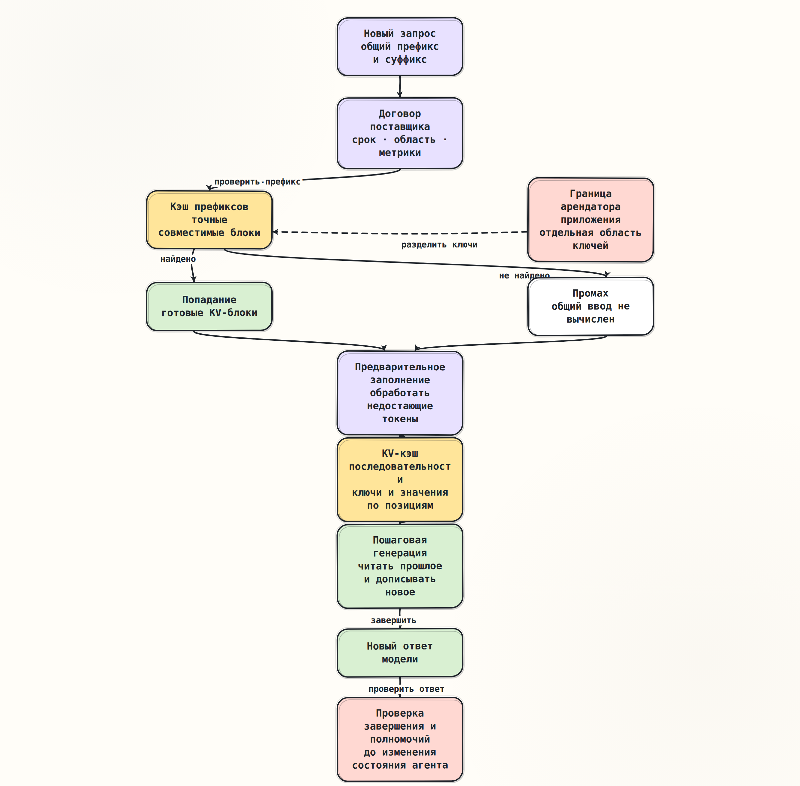

# Устройство кэшей

> [Основной план, промпт 1.5](../../docs/senior_ai_agent_engineer_2026.md#промпт-15-устройство-кэшей)

## Краткое содержание

Под словом «кэш» здесь скрываются три разных механизма. KV-кэш одной
генерации сохраняет промежуточные ключи и значения уже обработанных позиций.
Кэш префиксов позволяет повторно использовать совместимую начальную часть
этого состояния между запросами. Кэширование у поставщика — внешний договор
API: какие начальные токены считаются совпавшими, сколько живёт запись, как
она изолируется и какие показатели возвращаются клиенту.

KV-кэш текущей генерации ускоряет пошаговую генерацию относительно полного
пересчёта истории. Межзапросный кэш префиксов и кэширование у поставщика могут
дополнительно сократить предварительное заполнение, время до первого токена и,
по договору API, стоимость входа. Они не заменяют генерацию нового ответа и
не являются памятью агента. Попадание в кэш не доказывает, что прежний запрос
завершился, пользователь подтвердил действие или инструмент уже был вызван.

## Ключевые понятия

| Понятие | Точное значение |
|---|---|
| Предварительное заполнение (`prefill`) | Обработка входных токенов и построение начального KV-кэша до выбора первого выходного токена |
| Пошаговая генерация (`decode`) | Последовательное создание новых токенов; каждый шаг читает прошлые ключи и значения и дописывает новые |
| KV-кэш | Послойные тензоры ключей и значений для уже обработанных позиций одной или нескольких последовательностей |
| Кэш префиксов | Индекс повторно используемых KV-блоков для точного общего начала совместимых запросов |
| Кэширование у поставщика | Управляемая поставщиком услуга повторного использования входного префикса с собственными правилами API, сроком и тарификацией |
| Попадание | Найдена пригодная запись хотя бы для части начальных токенов |
| Промах | Пригодной записи нет; вход обрабатывается обычным способом |
| Вытеснение | Запись удаляется из-за нехватки памяти, окончания срока или внутренней политики |
| TTFT | Время от отправки запроса до появления первого выходного токена |
| Граница арендатора | Область, внутри которой разрешено повторное использование данных и измерений кэша |

## Основные идеи

Начнём с того, какие вычисления выполняются один раз для входа, а какие
повторяются при создании каждого нового токена.

### Два этапа одного вывода

Во время предварительного заполнения модель принимает весь вход целиком либо
крупными фрагментами. На каждом слое механизма внимания для каждой позиции
вычисляются ключ и значение. Получившийся KV-кэш содержит промежуточное
состояние входной последовательности. Прямой проход выдаёт оценки следующего
токена, а алгоритм декодирования выбирает по ним первый выходной токен.

Во время пошаговой генерации модель обрабатывает по одному новому токену для
каждой активной последовательности. Новый запрос внимания сравнивается со
всеми допустимыми прошлыми ключами, использует соответствующие значения, а
ключ и значение новой позиции добавляются в кэш. Старые запросы внимания
хранить не требуется: они уже выполнили свою работу.

KV-кэш устраняет повторное вычисление представлений прошлых позиций, но не
делает цену следующего токена постоянной. Новому токену всё равно приходится
читать растущую историю ключей и значений. Поэтому длинный вход влияет не
только на предварительное заполнение, но и на последующую генерацию.

### Что именно хранится в KV-кэше

Ключи и значения — не исходный текст, не векторные представления токенов и не
готовый ответ модели. Это производные тензоры, зависящие одновременно от:

- точной версии модели и её весов;
- слоя, позиции и головы внимания;
- причинного префикса до рассматриваемой позиции;
- позиционного кодирования, адаптеров и других влияющих на вычисление
  параметров.

Полезный объём памяти для полного внимания можно грубо оценить так:

```text
память ≈ 2 × число_слоёв × число_KV_голов × размер_головы
          × байт_на_элемент × сумма(T_i)
```

Множитель `2` соответствует отдельным ключам и значениям. Групповое или
многозапросное внимание уменьшает число KV-голов. Здесь `T_i` — число
закэшированных позиций в каждой активной последовательности; при одинаковой
длине сумма равна числу последовательностей, умноженному на их длину. Лучи и
параллельные продолжения тоже считаются отдельными последовательностями, если
их блоки не разделяются. Квантизация уменьшает число байтов на элемент, а
скользящее окно ограничивает число сохраняемых позиций. Разбиение на страницы
уменьшает фрагментацию и облегчает совместное владение блоками, но не меняет
математический смысл ключей и значений.

Полный послойный набор ключей и значений позиции определяется причинным
префиксом до неё. В первом слое проекции могут зависеть только от текущего
токена и позиции, а в последующих слоях их вход уже содержит результат
внимания к предыдущим позициям.

### Три разных уровня повторного использования

| Свойство | KV-кэш текущей генерации | Кэш префиксов | Кэширование у поставщика |
|---|---|---|---|
| Главная задача | Не пересчитывать прошлые позиции на каждом новом токене | Не пересчитывать общий вход между запросами | Дать клиенту управляемое или автоматическое повторное использование входа |
| Владелец | Сервер вывода модели | Сервер вывода или его планировщик | Сервис поставщика |
| Область повторного использования | Одно логическое продолжение | Несколько совместимых запросов | Учётная область, проект или организация по правилам поставщика |
| Адресация | Идентификатор последовательности и позиция либо таблица блоков | Точный индекс префикса: например, цепочка хешей блоков или префиксное дерево | Скрытый ключ поставщика, явный ресурс либо подсказка API |
| Обычное время жизни | До завершения или приостановки последовательности | До вытеснения или окончания срока | По документированному сроку и политике сервиса |
| Наблюдаемость | Память, длина последовательности, скорость генерации | Число найденных блоков и сэкономленных входных токенов | Поля использования, срок и стоимость, доступные через API |
| Что ускоряет | Пошаговую генерацию относительно полного пересчёта истории | Предварительное заполнение совпавшего префикса | Обычно предварительное заполнение и тарифицируемый вход |

Кэш префиксов обычно хранит те же виды KV-тензоров, что и кэш текущей
генерации. Отличаются владение, индексирование и жизненный цикл. Кэширование у
поставщика нельзя автоматически считать тем же самым механизмом: внешний API
описывает наблюдаемое поведение, а физическая реализация может быть скрыта и
изменяться.



### Почему совпадает только начало

Пусть два запроса после токенизации выглядят так:

```text
Запрос 1: [общие правила] [справочник] [вопрос А]
Запрос 2: [общие правила] [справочник] [вопрос Б]
```

Второй запрос может повторно использовать состояние общих правил и
справочника. Различающийся вопрос находится после общей части, поэтому не
портит её.

Теперь изменим один токен внутри справочника. Математически состояние позиций
до изменения остаётся пригодным, а состояние изменённой и всех последующих
позиций нужно построить заново. На следующем слое каждая поздняя позиция уже
зависит от изменённого причинного окружения. Блочный кэш обычно повторно
использует только полные совпавшие блоки, поэтому фактическое попадание
закончится на границе блока перед изменённым токеном. Вставка или удаление
дополнительно сдвигает позиции суффикса.

Практическое следствие: в пределах разрешённого формата и без изменения
семантики запроса стабильные части размещают раньше изменяемых. Обязательный
порядок ролей, сообщений и определений инструментов сохраняют. Метка времени,
случайный идентификатор или нестабильный порядок ключей JSON в начале запроса
способны уничтожить почти всю пользу кэша.

Совпадение строк ещё не гарантирует совпадение токенов. На результат влияют
точная сериализация, токенизатор, порядок частей, изображения, определения
инструментов, версия модели и адаптеры. Кэш префиксов — не смысловой поиск
«похожего текста».

### Причинная связь с агентом

Кэш относится к вычислению модели, а не к каноническому состоянию агента:

1. Попадание или промах меняет наблюдаемые показатели запроса: объём повторно
   использованного входа, задержку и стоимость.
2. Агент всё ещё находится в состоянии ожидания ответа модели. Попадание не
   создаёт `ModelResponse`, не подтверждает завершение и не добавляет сообщение
   в историю.
3. Решение модели всё равно генерируется заново. Вызов инструмента получает
   полномочия только через обычную проверку завершённого ответа, схемы и
   политики доступа.
4. Вытеснение записи должно приводить лишь к более дорогому промаху, а не к
   изменению логики приложения или потере бизнес-состояния.

Инвариант: удаление всего кэша не меняет корректность решения агента и не
теряет подтверждённое состояние; меняются только задержка, нагрузка и
стоимость. Если после очистки кэша агент «забывает» обязательство пользователя
или повторяет побочный эффект, приложение ошибочно использовало кэш как
память либо журнал.

Для состояния нужны долговечная запись, журнал событий или контрольная точка.
Кэш не доказывает ни один из следующих фактов:

- предыдущий запрос существовал или успешно завершился;
- ответ был показан пользователю;
- пользователь дал согласие;
- инструмент был вызван или его побочный эффект зафиксирован;
- текущий запрос принадлежит той же сессии или тому же арендатору;
- новый ответ будет дословно совпадать с прежним.

### Несколько арендаторов и конфиденциальные данные

Повторное использование между арендаторами опасно даже тогда, когда API не
возвращает сохранённый текст. Различие задержек между попаданием и промахом
может стать побочным каналом: атакующий проверяет, встречался ли выбранный
префикс. Ошибка в области ключей может также дать запросу доступ к
производному состоянию чужих данных.

Безопасный ключ должен учитывать как минимум:

```text
(область_арендатора,
 версия_модели,
 версия_токенизатора,
 версия_адаптера,
 токены_префикса,
 влияющие_параметры)
```

Для недоверяющих друг другу арендаторов нужны раздельные пространства ключей.
В самостоятельно управляемом кэше соль можно включить в хеш первого блока;
сервис поставщика может не давать такого средства. Особенно чувствительные
префиксы стоит исключать из межзапросного кэша, если развёртывание это
позволяет. Граница организации или проекта у поставщика не заменяет
разграничение арендаторов внутри приложения.

Идентификатор явного ресурса кэша тоже считается защищаемым объектом: сервер
должен проверить его принадлежность, а не принимать значение от клиента без
проверки. Ошибка здесь способна не просто раскрыть признак наличия записи, а
передать содержимое чужого ресурса модели как префикс нового запроса.

### Как измерять пользу

Одной доли запросов с попаданием недостаточно. Запрос, в котором повторно
использовано десять токенов, и запрос с десятью тысячами повторно
использованных токенов дают одинаковый счётчик, но разную экономию.

Минимальный набор показателей:

- доля запросов с ненулевым числом кэшированных токенов;
- доля кэшированных токенов во всём пригодном входе;
- медиана и 95-й процентиль TTFT отдельно для попаданий и промахов;
- число входных токенов, учтённых как новые, либо доступный расчётный
  показатель, если фактический объём вычислений не раскрывается;
- составляющие стоимости, которые отдельно тарифицирует выбранный поставщик;
- частота вытеснений и срок жизни записей, если сервер раскрывает эти данные;
- скорость пошаговой генерации при сопоставимом контексте и длине ответа.

```text
доля_запросов = запросы_с_попаданием / повторные_запросы

доля_токенов = сумма_кэшированных_токенов / сумма_входных_токенов
```

Знаменатель берут из документированного поля использования конкретного API.
Если сервис не сообщает причину промаха или число фактически вычисленных
токенов, эти величины нельзя выдавать за прямое измерение: допустим только
явно названный расчётный показатель.

Сравнивать нужно холодный первый запрос, тёплый повтор, изменение раннего
токена, изменение только суффикса и тот же текст в области другого арендатора.
Для честного сравнения фиксируют модель, сериализацию входа, предел выхода и
примерно одинаковую длину ответа. TTFT измеряют на потоковом интерфейсе от
момента отправки до первого содержательного события, а не до получения всего
ответа.

### Что обещают поставщики

Сведения ниже проверены по официальной документации 13 августа 2026 года.
Это наблюдаемые договоры API, а не обещание конкретной внутренней реализации.

#### OpenAI Responses

- **Механизм.** Попадание требует точного совпадения префикса. Для GPT-5.6 и
  новее минимальный сформированный префикс до точки равен 1024 токенам; по
  умолчанию неявная точка ставится на последнее сообщение пользователя или
  инструмента, также доступны явные точки. Более ранние модели используют
  автоматическое кэширование с зависящим от модели минимумом от 1024 до 2048
  токенов.
- **Срок и изоляция.** Для GPT-5.6 и новее `prompt_cache_options.ttl` задаёт
  срок всех записываемых запросом точек; единственное и стандартное значение —
  `30m`, а повторное использование обновляет срок пригодности.
  `prompt_cache_key` помогает направлять запросы с общим длинным префиксом, но
  не является документированной границей изоляции. Кэши разных организаций не
  разделяются.
- **Наблюдаемость.** В `usage.input_tokens_details` поле `cached_tokens`
  показывает прочитанные из кэша токены, а `cache_write_tokens` — вновь
  записанные токены GPT-5.6 и новее независимо от режима. `usage.input_tokens`
  остаётся числом токенов всего входа.

#### Anthropic API

- **Механизм.** Явная точка `cache_control` на блоке включает сам блок и весь
  предшествующий префикс. Верхнеуровневый автоматический режим выбирает
  последний пригодный блок. Порядок — определения инструментов, системные
  блоки, затем сообщения.
- **Срок.** По умолчанию запись живёт 5 минут; доступен срок `1h`. На один
  запрос есть четыре слота, один из которых занимает автоматическая точка.
- **Наблюдаемость.** Запись, чтение и обычный суффикс разделены между
  `cache_creation_input_tokens`, `cache_read_input_tokens` и `input_tokens`.

#### Gemini API

- **Механизм.** Неявный режим автоматически включён для Gemini 2.5 и новее.
  Явный режим создаёт ресурс `CachedContent` для `generateContent`, но не
  поддерживается в Interactions API. Содержимое, модель, системная инструкция,
  инструменты и отображаемое имя ресурса неизменяемы; сам ресурс применим
  только с той моделью, для которой создан.
- **Срок.** У явного ресурса срок по умолчанию равен одному часу; его можно
  изменить через `ttl` или `expireTime`. Неявный кэш хранится в оперативной
  памяти, изолируется в пределах одного облачного проекта Google и имеет срок
  24 часа; это не создаёт изоляцию арендаторов внутри одного проекта.
- **Наблюдаемость.** В `generateContent` поле
  `usageMetadata.cachedContentTokenCount` показывает повторно использованные
  токены, а `usageMetadata.promptTokenCount` — весь вход, включая эту часть.
  Размер явного ресурса находится в
  `CachedContent.usageMetadata.totalTokenCount`. Interactions API возвращает
  `usage.total_cached_tokens`.

У всех трёх поставщиков кэшированный вход продолжает занимать контекстное
окно. Генерация ответа не превращается в выдачу сохранённого ответа. Точные
минимумы длины, цены, поддерживаемые модели и сроки меняются, поэтому их нужно
проверять перед внедрением и фиксировать вместе с датой измерения.

## Примеры

### Правильное расположение частей запроса

```text
1. Стабильные системные правила
2. Стабильные определения инструментов
3. Большой общий справочник
4. История конкретной сессии
5. Новый вопрос пользователя
```

Такой порядок сохраняет длинный общий префикс. Если поместить идентификатор
запроса или текущую дату в первую строку, совпадение оборвётся почти сразу.
Переменные значения лучше передавать в конце либо через отдельные поля, если
договор поставщика гарантирует, что они не участвуют в ключе.

### Промах не должен менять поведение

```python
result = await model_client.complete(request)
metrics.observe_cached_tokens(result.usage.cached_tokens)

# Решение принимается по проверенному результату, а не по факту попадания.
response = response_policy.require_completed(result.response)
agent_state.commit(response)
```

Приложение может использовать показатель попадания для телеметрии и выбора
экономичной конфигурации. Оно не должно пропускать проверку полномочий,
восстанавливать историю или решать, был ли выполнен инструмент, исходя из
наличия записи.

### Будущий эксперимент после команды `к практике`

Практика будет сравнивать детерминированную имитацию и настоящий API на одной
матрице случаев:

| Случай | Ожидаемый смысл результата |
|---|---|
| Первый запрос с длинным общим префиксом | Холодная запись или полный промах |
| Точный повтор | Максимально возможное повторное использование префикса |
| Изменение одного раннего токена | Совпадение только до изменённого блока |
| Изменение суффикса | Общий префикс остаётся пригодным |
| Тот же текст у другого арендатора | Изоляция важнее доли попаданий |
| Конфиденциальный префикс | Нет утечки содержимого или признака присутствия через чужую область |

Код, реальные вызовы и таблица измерений появятся только после команды
`к практике`. До неё конспект остаётся теорией для обсуждения.

## Заметки и наблюдения

### Полезные границы

- Частичное совпадение блоков не означает, что весь запрос был кэширован.
- Запись может исчезнуть раньше ожидаемого из-за вытеснения; приложение должно
  сохранять корректность при полном промахе.
- Кэшированный вход обычно остаётся частью лимита контекстного окна.
- Экономия на обработке входа не гарантирует заметного ускорения короткого
  запроса: сеть, очередь и долгая генерация могут преобладать.
- Частые записи без достаточного числа повторных чтений способны увеличить
  стоимость, особенно если поставщик отдельно тарифицирует запись и хранение.
- Параллельные одинаковые запросы могут не увидеть только что создаваемую
  запись, пока она не стала доступной по правилам поставщика.
- Метрика API сообщает учтённые кэшированные токены, но не обязана раскрывать
  физическое размещение KV-блоков.

### Проверка архитектурного решения

Если команда предлагает назвать кэш «памятью агента», полезен простой
опровергающий эксперимент:

1. Выполнить сценарий с подтверждённым обязательством или побочным эффектом.
2. Удалить все записи кэша либо дождаться их окончания.
3. Восстановить процесс из канонического состояния и продолжить сценарий.
4. Проверить, что обязательство не потеряно, а побочный эффект не повторён.

Провал означает не проблему настройки срока, а ошибочную границу
ответственности. Кэш может ускорять восстановленный запрос, но истина должна
находиться в журнале, базе данных или контрольной точке.

## Вопросы для повторения

1. Почему KV-кэш хранит ключи и значения, но не старые запросы внимания?
2. Чем кэш текущей генерации отличается от межзапросного кэша префиксов?
3. Почему изменение одного раннего токена делает непригодным весь последующий
   KV-кэш, но не позиции до изменения?
4. Почему попадание обычно сокращает предварительное заполнение и TTFT, но не
   устраняет пошаговую генерацию?
5. Какие параметры кроме токенов должны входить в область совместимости?
6. Почему границы проекта поставщика недостаточно для нескольких арендаторов
   одного приложения?
7. Чем доля кэшированных токенов полезнее одной доли запросов с попаданием?
8. Как очистка кэша проверяет, не используется ли он как состояние агента?

## Итоги

KV-кэш — производное состояние механизма внимания, кэш префиксов — способ
разделять совместимые начальные блоки, а кэширование у поставщика — договор
внешнего API. Общий префикс экономит предварительное заполнение только при
точном совпадении токенов и влияющих параметров. Цена этой оптимизации —
память, сложность измерений, вытеснение и дополнительная граница безопасности.

Для агента правило короткое: кэш можно использовать для ускорения, но нельзя
использовать как доказательство состояния, полномочий или совершённого
побочного эффекта. После изучения теории следующий шаг — задать вопросы; к
эксперименту переходим только по команде `к практике`.

## Источники

- [Архитектура механизма внимания](https://proceedings.neurips.cc/paper_files/paper/2017/hash/3f5ee243547dee91fbd053c1c4a845aa-Abstract.html) — исходная статья о многоголовом внимании и причинной маске.
- [Объяснение KV-кэша в библиотеке `Transformers`](https://huggingface.co/docs/transformers/v5.14.0/cache_explanation) — форма тензоров, послойное хранение и рост по длине последовательности; версия 5.14.0.
- [Статья о PagedAttention](https://arxiv.org/abs/2309.06180) — устройство памяти KV-кэша, разбиение на блоки и совместное владение.
- [Кэширование префиксов в vLLM](https://docs.vllm.ai/en/v0.22.1/features/automatic_prefix_caching/) и [устройство ключей блоков](https://docs.vllm.ai/en/v0.22.1/design/prefix_caching/) — граница между предварительным заполнением и генерацией, хеширование и соль; версия 0.22.1.
- [Кэширование входа в OpenAI Responses](https://developers.openai.com/api/docs/guides/prompt-caching) — совпадение префикса, точки разрыва, сроки и показатели; проверено 13 августа 2026 года.
- [Кэширование входа в Anthropic API](https://platform.claude.com/docs/en/build-with-claude/prompt-caching) — точки `cache_control`, сроки и поля использования; проверено 13 августа 2026 года.
- [Кэширование контекста в Gemini API](https://ai.google.dev/gemini-api/docs/generate-content/caching?hl=en) и [ресурс `CachedContent`](https://ai.google.dev/api/caching?hl=en) — неявный и явный режимы, жизненный цикл и показатели; проверено 13 августа 2026 года.
