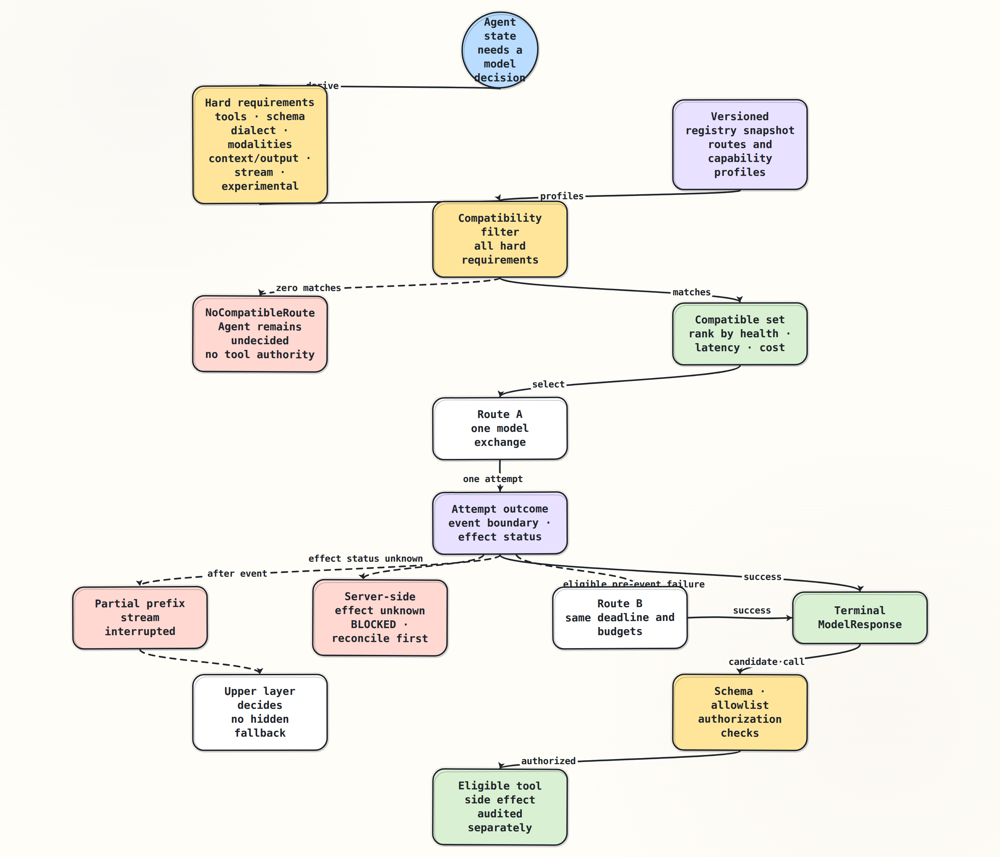

# Возможности и резервный маршрут

> [Основной план, модуль 01](../../docs/senior_ai_agent_engineer_2026.md)

## Краткое содержание

Fallback — это не «следующая модель в списке», а повторный выбор только среди
routes, которые сохраняют обязательную семантику текущего шага Agent. Router
сначала проверяет tools, schema mode, modalities, context, streaming и
experimental opt-ins, а уже затем ранжирует совместимые routes по health,
latency и cost. Если полного match нет, корректный результат — typed
`NoCompatibleRoute`, а не молчаливое удаление tool или ослабление schema.

## Ключевые понятия

| Понятие | Смысл |
|---|---|
| Route | `ModelRoute`: стабильный route ID, adapter/client и конкретный capability profile |
| Profile | `CapabilityProfile`: проверенные свойства эффективной provider configuration |
| Requirements | `CapabilityRequirements`: hard requirements одного model decision, сформированные до routing |
| Hard requirement | Условие корректности, которое ranking policy не имеет права ослабить |
| Preference | Health, latency, cost, locality или quality score среди уже совместимых routes |
| Report | `CompatibilityReport`: полный результат проверки route с typed gaps и provenance |
| No match | `NoCompatibleRoute`: fail-closed исход до model call, если ни один route не удовлетворяет требованиям |
| Explicit degradation | Новый application decision с изменёнными requirements и audit record |

Capability относится не только к `model_name`, а к эффективной конфигурации:

```text
provider + model/snapshot + API surface + options/headers + region/account
```

Один mutable alias может со временем указывать на другой snapshot. Одна модель
может иметь разные возможности на Responses, Realtime или legacy endpoint.
Beta header, entitlement и region также меняют эффективный contract.

## Основные идеи

### Проблема: availability без semantic corruption

Пусть Agent должен разобрать screenshot, вернуть strict `change_plan/v1` и при
необходимости предложить `propose_patch`. Primary route недоступен. Дешёвый
fallback принимает только text, генерирует best-effort JSON и не знает
`propose_patch`.

Если router удалит image, tool или strict schema и всё же вернёт обычный
`ModelResponse`, Agent продолжит работу в ложном состоянии: снаружи exchange
выглядит успешным, но пространство допустимых решений уже изменилось. Это не
degradation latency или quality, а подмена задачи.

Инвариант routing:

```text
selected_route.capabilities satisfies every hard requirement
```

`unknown` не означает `supported`. Если metadata недостаточно, route считается
несовместимым до успешного probe или обновления manifest.

### Requirements и profiles — разные модели

`CapabilityProfile` описывает, что route технически способен предложить.
`CapabilityRequirements` описывает, что нужно конкретному Agent transition.
Один и тот же route может быть совместим с текстовой классификацией и
несовместим с multimodal tool-using шагом.

Минимальное отношение совместимости:

```text
requirements.tools              ⊆ profile.available_tools
requirements.input_modalities   ⊆ profile.input_modalities
requirements.output_modalities  ⊆ profile.output_modalities
requirements.min_total_tokens   ≤ profile.context_window_tokens
requirements.min_output_tokens  ≤ profile.max_output_tokens
requirements.schema.mode        ∈ profile.schema_modes
schema_preflight(requirements.schema, profile.schema_dialect) = compatible
requirements.stream_mode        ∈ profile.stream_modes
requirements.experimental       ⊆ profile.experimental_features
profile.maturity                ∈ requirements.allowed_maturity
```

Context demand включает system prompt, history, tool definitions/results,
multimodal inputs и output reserve. Кроме общего окна отдельно проверяется
provider-specific maximum output: большое окно не гарантирует нужную длину
ответа. Одного `len(user_text)` недостаточно. Input и output modalities
хранятся раздельно: image input не подразумевает image output.

Метка `strict` тоже лишь необходимое, но не достаточное условие. Providers
поддерживают разные подмножества и диалекты JSON Schema, поэтому registry
хранит dialect/constraints, а schema проходит preflight для конкретного route.
Неизвестный keyword или неподдержанная комбинация дают typed gap до model call.

Tools тоже не сводятся к `supports_tools=True`. Нужны как минимум technical
tool IDs, execution locus (`client` или `server`), schema mode и ограничения
parallel calls. Наличие tool в profile означает только способность model
предложить call; оно не выдаёт execution authority.

### Независимые flags могут лгать

Поддержка tools и strict structured output по отдельности не доказывает их
совместную поддержку. Реальный profile лучше хранит supported modes или
constraints:

```text
mode: streaming + client_tools + strict_tool_schema
mode: non_streaming + structured_final_response
constraint: structured_final_response + built_in_tools = preview_only
```

В небольшой практике 1.4 начнём с явных полей и отдельного списка versioned
experimental features. Ограничение такой модели нужно сохранить: production
registry обязан описывать существенные комбинации, а не вычислять их как
произведение независимых boolean.

### Execution flow



1. Agent state и разрешённый набор tools порождают hard requirements.
2. Router читает immutable registry snapshot и строит `CompatibilityReport`
   для каждого candidate route.
3. Compatibility filter исключает routes с любым gap до adapter invocation.
4. Ranking policy сравнивает только совместимые routes по health, latency,
   cost или eval score.
5. Выбранный adapter выполняет ровно один exchange. Routing остаётся над
   `ModelClient`, а не скрывается внутри него.
6. Upper runtime может выбрать следующий совместимый route под тем же absolute
   deadline и budgets только при eligible failure: до первого принятого stream
   event **и** когда side effect на server-side tool заведомо невозможен либо
   reconciliation уже подтвердил его отсутствие.
7. После принятого event действует правило темы 1.3: никакого transparent
   cross-model fallback и склейки prefixes. Наружу идёт
   `ModelStreamInterrupted`, дальнейшее решение принимает upper layer.
8. Terminal `ModelResponse` возвращается Agent. Tool call ещё проходит schema,
   allowlist и authorization checks перед side effect.

Граница первого события говорит о наблюдаемом потоке, но не доказывает, что
server-side tool не успел выполниться. При неизвестном effect status Agent
переходит в blocked/reconciliation state; автоматический fallback запрещён.
Idempotency key помогает reconcile или безопасно повторить уже известную
операцию, но сам по себе не доказывает эквивалентность нового model decision.

### Границы ответственности

| Компонент | Владеет | Не должен делать |
|---|---|---|
| Registry | Route profiles, provenance, revision, `verified_at` | Ранжировать, вызывать model или авторизовать tool |
| Compatibility filter | Hard matching и typed gaps | Ослаблять requirements ради availability |
| Ranking policy | Порядок совместимых routes | Делать несовместимый route допустимым |
| Adapter / `ModelClient` | Один provider exchange и нормализация | Скрыто менять model или делать fallback |
| Agent/application | Explicit degradation и state transition | Считать route selection tool authority |
| Tool boundary | Schema, allowlist, authorization, idempotency | Исполнять partial или непроверенный call |

Router не мутирует route-neutral request template. Текущий `ModelRequest.model`
обязателен, поэтому после выбора route строится новый route-specific
`ModelRequest(model=selected_route.model, ...)` с неизменными messages, tools,
format и application request ID. Fallback B никогда не получает model ID от A.
Если fallback требует удалить tool, сжать context, преобразовать image в
description или перейти со strict schema на prose, это новый application
decision и новый template/request с audit record.

### Причинная связь с Agent

Несовместимая ветка:

```text
capability filter rejects cheap fallback
→ Agent: BUILDING_CHANGE_PLAN → BLOCKED_BY_CAPABILITY
→ terminal model decision отсутствует
→ tool call и execution authority отсутствуют
→ repository state не меняется
```

Совместимая ветка:

```text
compatible fallback → terminal ModelResponse
→ proposal enters Agent state
→ schema + allowlist + authorization checks
→ only then an eligible tool side effect
```

Routing сохраняет возможность получить корректное model proposal. Он не
авторизует side effect и не доказывает качество ответа.

## Примеры

### Compatibility matrix

Текущий шаг требует `search_evidence`, `propose_patch`, image input, strict
`change_plan/v1` в совместимом schema dialect, streaming, total context `52k`,
output reserve `4k` и versioned feature `reasoning_budget:v1`.

| Requirement | Primary A | Fallback B | Cheap C |
|---|---:|---:|---:|
| Tools `{search_evidence, propose_patch}` | оба | оба | только `search_evidence` |
| Strict `change_plan/v1` | да | да | best-effort JSON |
| Input `{text, image}` | да | да | только text |
| Total context demand `52k` | `128k` | `64k` | `128k` |
| Output reserve `4k` | max `16k` | max `8k` | max `16k` |
| Streaming | да | да | да |
| `reasoning_budget:v1` | да | да | нет |
| Result | compatible | compatible | four gaps |

Если A возвращает `503` до первого event и его contract исключает server-side
side effect, failure eligible и policy выбирает B. C не становится допустимым
из-за низкой цены. Если B отсутствует, router возвращает `NoCompatibleRoute` с
четырьмя gaps и не вызывает ни один incompatible client. Если effect status A
неизвестен, Agent блокируется для reconciliation вместо автоматического B.

### Маленький provider-neutral sketch

Это форма будущего контракта, а не реализация практики:

```python
@dataclass(frozen=True, slots=True)
class SchemaRequirements:
    mode: str
    dialect: str
    keywords: frozenset[str]


@dataclass(frozen=True, slots=True)
class CapabilityRequirements:
    tools: frozenset[str]
    input_modalities: frozenset[str]
    schema: SchemaRequirements
    min_total_tokens: int
    min_output_tokens: int
    stream_mode: str
    experimental: frozenset[str]
    allowed_maturity: frozenset[str]


def select(routes, required):
    checks = tuple(check(route.profile, required) for route in routes)
    compatible = [
        route
        for route, report in zip(routes, checks, strict=True)
        if not report.gaps
    ]
    if not compatible:
        raise NoCompatibleRoute(checks)
    return rank(compatible)[0]
```

Важен порядок операций: `check → filter → rank`. Конструкция
`rank(all_routes)[0] → strip_unsupported_fields` принципиально неверна.

### Каким должен быть decision trace

```text
requirements_revision=change-plan/v1
registry_revision=2026-08-12.3
candidate=primary-a     compatible=true
candidate=fallback-b    compatible=true
candidate=cheap-c       gaps=tool,strict_schema,image,experimental
selected=fallback-b     reason=primary_effect_free_failure_before_first_event
```

Trace нужен для incident analysis и replay. Он фиксирует факты routing, но не
обязан содержать prompt или sensitive tool arguments.

## Заметки и наблюдения

### Связь с текущим кодом

- [`ModelRequest.tools`](../../lessons/module_01_provider_contract/implementation/contracts.py)
  и `JsonSchemaFormat` уже выражают часть requirements.
- `InputMessage.content` пока только `str`; input/output modalities отдельно не
  моделируются.
- `ModelClient.complete()` и `stream()` означают один exchange. Наличие метода
  `stream()` в Protocol не доказывает поддержку streaming конкретным route.
- `UnsupportedCapability` защищает adapter boundary, когда provider фактически
  отклоняет request. Multi-route failure дополнительно требует structured
  `NoCompatibleRoute` с reports всех candidates.
- `StreamingRuntime` темы 1.3 делает bounded retry того же client после раннего
  `429`; это не cross-model fallback. Новый router должен наследовать исходный
  absolute deadline.

Новые capability types лучше добавлять в отдельный урок, не меняя поля
`ModelRequest`: текущие темы и contract tests зависят от него. До выбора route
нужен route-neutral template; затем для каждой попытки строится новый
`ModelRequest` с model выбранного route и неизменными messages, tools, format и
application request ID.

### Registry — проверенный manifest, а не истина навсегда

Provider discovery endpoints различаются. Например, OpenAI Models API отдаёт
базовую identity metadata, тогда как capability comparison опубликован в
отдельном catalog; Anthropic Models API включает больше capability metadata;
Gemini Models API публикует token limits и generation methods, но не весь
routing contract. Поэтому production registry объединяет versioned manifest,
primary docs, account/region configuration и controlled probes.

Profile должен хранить `source`, `observed_at`, API surface, snapshot/alias,
region и entitlement. Stale profile всё равно может ошибиться, поэтому adapter
сохраняет defensive `UnsupportedCapability` и обновляет telemetry.

### Что compatibility не доказывает

- качество, factual correctness и semantic correctness результата — это eval;
- доступность прямо сейчас — это health/quota signal;
- tenant authorization и data residency — это policy eligibility;
- корректность конкретного tool call — это schema и business validation;
- право исполнить side effect — это отдельная authorization boundary.

Эти оси участвуют в route eligibility или ranking, но не должны смешиваться в
один непрозрачный `supports_request=True`.

### Ограничения будущей практики

- Начальный registry будет static и deterministic, без live provider API.
- Context field будет declared minimum window, а не полноценный tokenizer и
  exact prompt estimator.
- Tool identity начнётся с name; version/schema fingerprint появятся в модуле
  про tool protocol.
- Простая модель capability combinations не покроет все vendor constraints.
- Property tests докажут routing invariants на fake profiles, но не реальные
  provider entitlements или quality.

## Вопросы для повторения

1. Почему fallback является semantic decision, а не просто retry policy?
2. Чем hard requirement отличается от preference?
3. Почему `supports_tools=True` недостаточно для tool-using Agent?
4. Почему image input и image output — разные capabilities?
5. Зачем context requirement учитывать вместе с output reserve?
6. Почему support tools и strict schema нельзя всегда проверять независимо?
7. Что должен сделать router, если capability metadata имеет состояние
   `unknown`?
8. Почему route selection не выдаёт execution authority для tool?
9. Почему отсутствие stream event недостаточно и когда cross-model fallback
   всё же допустим?
10. Какие данные нужны в compatibility report и routing audit trail?

## Итоги

Capability-aware routing отделяет доступность от semantic degradation.
Registry хранит versioned facts, compatibility filter fail-closed проверяет
hard requirements, ranking policy выбирает среди matches, а adapter выполняет
один exchange. Несовместимый fallback не становится допустимым из-за цены или
health. Любое ослабление requirements — отдельное решение application с новым
Agent state и audit trail.

После команды `к практике` реализуем этот механизм с нуля: immutable registry
без `if model_name`, typed compatibility reports, fail-closed router и
deterministic property tests. Framework на этой стадии не нужен.

## Источники

Изменчивые provider capabilities проверены по primary documentation
`2026-08-12`. Конспект не фиксирует mutable model aliases как вечную истину;
ссылки служат provenance для архитектурных выводов:

- OpenAI: [Function calling](https://developers.openai.com/api/docs/guides/function-calling),
  [Structured Outputs](https://developers.openai.com/api/docs/guides/structured-outputs),
  [Streaming responses](https://developers.openai.com/api/docs/guides/streaming-responses),
  [Model comparison](https://developers.openai.com/api/docs/models/compare),
  [Models API](https://developers.openai.com/api/reference/resources/models)
- Anthropic: [How tool use works](https://platform.claude.com/docs/en/agents-and-tools/tool-use/how-tool-use-works),
  [Strict tool use](https://platform.claude.com/docs/en/agents-and-tools/tool-use/strict-tool-use),
  [Fine-grained tool streaming](https://platform.claude.com/docs/en/agents-and-tools/tool-use/fine-grained-tool-streaming),
  [Models overview](https://platform.claude.com/docs/en/about-claude/models/overview),
  [Beta headers](https://platform.claude.com/docs/en/api/beta-headers)
- Google Gemini: [Function calling](https://ai.google.dev/gemini-api/docs/function-calling),
  [Structured Outputs](https://ai.google.dev/gemini-api/docs/structured-output),
  [Models API](https://ai.google.dev/api/models),
  [API and streaming surfaces](https://ai.google.dev/api),
  [Model version patterns](https://ai.google.dev/gemini-api/docs/models)
- Локальные источники: [основной план, промпт 1.4](../../docs/senior_ai_agent_engineer_2026.md#промпт-14-возможности-и-резервный-маршрут),
  [контракт темы 1.2](../../lessons/module_01_provider_contract/implementation/contracts.py),
  [runtime темы 1.3](../../lessons/module_01_streaming_cancellation/implementation/execution.py)
