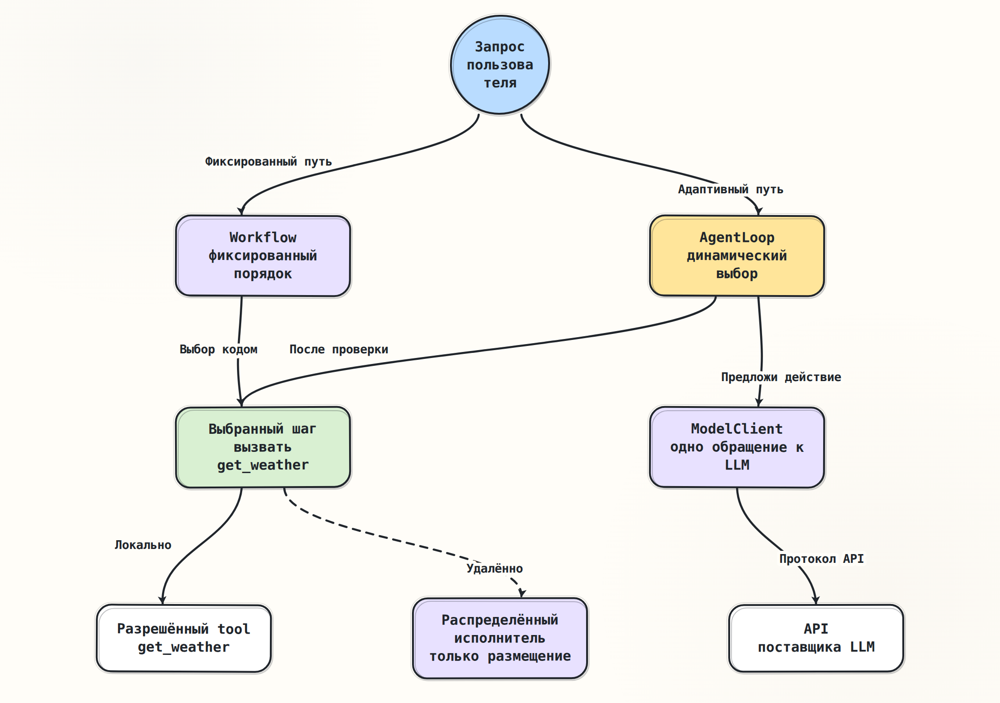

# LLM — ещё не Agent: границы исполнения

> [Основной план, модуль 01](../../docs/senior_ai_agent_engineer_2026.md)

## Краткое содержание

`ModelClient`, `AgentLoop`, `Workflow` и `DistributedExecutor` отвечают на
разные вопросы и могут участвовать в обработке одного запроса одновременно.
`ModelClient` выполняет один обмен с LLM, `AgentLoop` выбирает следующий шаг,
`Workflow` задаёт неизменяемый бизнес-порядок, а `DistributedExecutor`
обеспечивает физическое выполнение задачи в одном из исполняющих процессов.
Главная граница доверия: ответ LLM, включая `tool call`, является данными и
предложением действия, но не самим действием.

## Ключевые понятия

- **LLM** — большая языковая модель: вероятностно продолжает входную
  последовательность и возвращает текст либо структурированные блоки. Сама по
  себе не владеет состоянием и полномочиями приложения.
- **Agent** — программная система, использующая LLM для выбора следующего
  действия в рамках заданных правил, состояния и лимитов.
- **`tool`** — разрешённая функция приложения с известным контрактом и
  контролируемыми полномочиями.
- **`tool call`** — структурированное предложение LLM вызвать `tool` с
  аргументами; до проверки и исполнения это недоверенные данные.
- **`ModelClient`** — адаптер одного обращения к LLM: переводит внутренний
  запрос в протокол поставщика и возвращает нормализованный результат.
- **`AgentLoop`** — цикл Agent: повторяет шаги «обратиться к LLM → проверить
  результат → при необходимости выполнить `tool` → добавить результат в
  `context`», пока не получен финальный ответ или не исчерпан лимит.
  `context` — факты и сообщения, доступные LLM на текущем шаге.
- **`Workflow`** — заранее заданный процесс: фиксирует допустимые шаги, ветви
  и бизнес-инварианты до выполнения запроса.
- **`DistributedExecutor`** — распределённый исполнитель: размещает попытки,
  отслеживает аренду задачи, отмену и крайний срок, не интерпретируя смысл
  запроса.

## Основные идеи

### Проблема: четыре разных вида управления

Фраза «система вызвала LLM и при необходимости выполнила `tool`» скрывает
четыре независимых решения:

1. **Протокол:** как сериализовать запрос, вызвать конкретного поставщика и
   без потерь разобрать его ответ? Это граница `ModelClient`.
2. **Семантический следующий шаг:** достаточно ли ответа, нужно ли вызвать
   `tool`, какой результат добавить в `context` и когда остановиться? Это
   граница `AgentLoop`.
3. **Бизнес-порядок:** какие этапы обязательны до и после Agent, какие ветви
   допустимы и какой инвариант должен сохраниться? Это граница `Workflow`.
4. **Физическое исполнение:** какой исполняющий процесс и какая попытка
   выполняют задачу, что делать при потере процесса и как передать отмену? Это
   граница `DistributedExecutor`.

Эти компоненты не образуют обязательный линейный конвейер. `AgentLoop` и
`Workflow` — два способа управлять смысловым переходом: в первом случае
следующее действие предлагается LLM во время исполнения, во втором оно заранее
закодировано. Их можно скомпоновать, например поместить один ограниченный шаг
`AgentLoop` внутрь более крупного `Workflow`, но границы ответственности от
этого не сливаются. Оба способа могут использовать `ModelClient` и `tool`, а
отдельный шаг или весь процесс может размещаться через
`DistributedExecutor`.

Две стрелки от запроса показывают альтернативы управления, а не одновременное
исполнение. Пунктирные стрелки от `DistributedExecutor` показывают
опциональное удалённое размещение уже выбранной работы; они не означают выбор
следующего шага. Результаты и ошибки возвращаются по соответствующему пути в
обратном направлении, причём каждый слой добавляет только свой контекст и не
скрывает исходную причину.

### Сравнение границ ответственности

Соответствие строк: 1 — `ModelClient`, 2 — `AgentLoop`, 3 — `Workflow`,
4 — `DistributedExecutor`.

| № | Что знает | За что отвечает | Что возвращает наверх |
|---|---|---|---|
| 1 | Протокол и возможности поставщика | Одно обращение к LLM: преобразование данных, отмена, крайний срок, нормализация | `UnsupportedCapability`, `ModelAuthError`, `ModelRateLimited`, `ModelTimeout`, `ModelProtocolError` |
| 2 | `context`, разрешённые `tool`, политика и лимит шагов | Проверка предложения, координация исполнения `tool`, обновление `context`, остановка цикла | `UnknownTool`, `InvalidToolArguments`, `ToolExecutionError`, `AgentStepLimitExceeded`; `ModelError` с номером шага |
| 3 | Этапы, ветви, бизнес-инварианты, общий крайний срок | Фиксированные переходы, состояние процесса, компенсация | `WorkflowInvariantViolation`, `WorkflowStepFailed`, `WorkflowDeadlineExceeded`, `CompensationFailed` |
| 4 | Задача, очередь, исполняющие процессы, аренды и номера попыток | Доставка, размещение, обнаружение сбоя, статус попытки | `TaskDispatchError`, `WorkerUnavailable`, `TaskLeaseLost`, `TaskDeadlineExceeded`, `AmbiguousCompletion` |

Слово «наверх» означает непосредственный вызывающий компонент. Например,
`ModelTimeout` сначала получает `AgentLoop`, затем `Workflow` может вернуть
`WorkflowStepFailed(cause=ModelTimeout)`. `DistributedExecutor` не должен
превращать это в безликое `TaskFailed`, иначе теряются решение о повторной
попытке, `retry_after`, идентификатор запроса поставщика и диагностическая
ценность.

Отказ LLM, финальный текст и `tool call` — варианты нормального ответа модели,
а не транспортные ошибки. Аналогично `city not found` является доменным
результатом `get_weather`, тогда как падение исполняющего процесса — ошибкой
инфраструктуры.

## Примеры

### Один поток: «Нужен ли сегодня зонт в Казани?»

Чтобы увидеть все четыре границы в одной трассе, предположим, что внешний
`Workflow` содержит один ограниченный шаг Agent, приложение разрешает только
`get_weather(city)`, а этот шаг запускается на удалённом исполняющем процессе:

1. `Workflow` принимает запрос и достигает заранее заданного шага
   «получить рекомендацию».
2. `DistributedExecutor` выдаёт попытку этого шага исполняющему процессу. Он
   видит `task_id`, крайний срок и входные данные, но не решает, нужна ли
   пользователю погода.
3. `AgentLoop` формирует `prompt` — инструкции и входные данные для LLM — и
   передаёт `ModelClient` текущий `context` вместе со схемой
   `get_weather`.
4. `ModelClient` выполняет одно обращение. LLM возвращает
   `tool call: get_weather(city="Казань")`.
5. `ModelClient` только нормализует этот блок. `AgentLoop` проверяет имя,
   аргументы, полномочия и лимит, затем приложение выполняет `tool`.
6. `AgentLoop` добавляет полученную температуру и осадки в `context` и через
   `ModelClient` делает второе обращение к LLM.
7. LLM возвращает финальный текст; `AgentLoop` завершает цикл.
8. `DistributedExecutor` фиксирует завершение попытки, а `Workflow` выполняет
   заранее заданную постобработку и возвращает ответ пользователю.

Если уже первое обращение вернуло финальный текст, шаги 5–6 отсутствуют. Если
погода нужна в каждом запросе без исключений, более простое базовое решение —
`Workflow → get_weather → детерминированное форматирование`; Agent оправдан
только тогда, когда адаптивный выбор действительно улучшает измеряемое
качество настолько, чтобы окупить задержку, стоимость и новые режимы отказа.

### Где возникает ошибка

- Поставщик LLM не ответил до крайнего срока: `ModelClient` возвращает
  `ModelTimeout`; он не объявляет ошибкой всего бизнес-процесса.
- LLM предложила `delete_account`, которого нет в разрешённом наборе:
  `AgentLoop` возвращает `UnknownTool`; запрос не доходит до исполнителя
  `tool`.
- Исполняющий процесс умер после побочного эффекта `tool`, но до подтверждения
  результата: `DistributedExecutor` сообщает `AmbiguousCompletion`.
  Автоматически повторять весь шаг опасно без `idempotency_key` и сохранённой
  контрольной точки.
- Финальный ответ нарушил обязательный бизнес-инвариант:
  `Workflow` возвращает `WorkflowInvariantViolation`, даже если все обращения
  к LLM и `tool` технически успешны.

## Заметки и наблюдения

### Инварианты границ

- `ModelClient` не выполняет `tool` и не поддерживает многошаговую цель.
- `AgentLoop` не знает формат обмена поставщика и не выбирает исполняющий
  процесс.
- `Workflow` не делегирует LLM шаги, порядок которых уже известен заранее.
- `DistributedExecutor` не решает, безопасна ли повторная попытка бизнес-
  операции. Гарантия «ровно один раз» не возникает из очереди или аренды:
  неоднозначное завершение требует идемпотентности и проверки фактического
  результата на границе побочного эффекта.
- `tool call` не является полномочием. Допуск, проверку схемы и границу
  арендатора контролирует приложение.

### Типичные ошибки проектирования

1. Выполнять `tool call` внутри `ModelClient`, смешивая недоверенный ответ
   поставщика с полномочиями приложения.
2. Называть одно обращение к LLM «Agent», хотя отсутствуют состояние, выбор
   шага и цикл.
3. Использовать Agent для фиксированного процесса, получая вероятностный и
   дорогой аналог обычного `Workflow`.
4. Считать `DistributedExecutor` источником бизнес-семантики или безопасно
   повторять всю задачу после любого сбоя исполняющего процесса.
5. Терять исходную ошибку при обёртывании на каждом слое.
6. Смешивать лимит одного обращения к LLM, лимит шагов Agent, крайний срок
   `Workflow` и аренду задачи: это разные бюджеты и разные причины завершения.

### Ограничения текущей модели

В уроке намеренно нет интерфейсов, формата обмена конкретного поставщика,
потоковых событий, частичного ответа, согласования возможностей, кэшей и
эксплуатационной механики повторов. Имена ошибок пока задают семантическую
классификацию, а не готовую иерархию классов. Без распределения
`DistributedExecutor` можно удалить; без адаптивного выбора можно удалить
`AgentLoop`.

## Вопросы для повторения

1. LLM сразу вернула финальный текст. Какие компоненты всё равно участвовали,
   а какой участок `AgentLoop` не выполнился?
2. Кто должен отклонить `tool call` с неизвестным именем и почему это не
   `ModelProtocolError`?
3. Исполняющий процесс пропал после записи во внешнюю систему. Почему новая
   попытка задачи не доказывает, что операция не выполнена дважды?
4. В каком месте сохраняется различие между `ModelTimeout` и
   `WorkflowDeadlineExceeded`?
5. Какой измеримый результат должен оправдать `AgentLoop`, если
   `get_weather` вызывается для каждого запроса?

## Итоги

LLM генерирует предложение ответа или действия; исполнение и ответственность
находятся в коде приложения. `ModelClient` изолирует протокол одного обращения,
`AgentLoop` управляет адаптивным многошаговым решением, `Workflow` фиксирует
известный порядок, а `DistributedExecutor` переносит вычисление между
исполняющими процессами.
Чёткие границы позволяют локализовать ошибки и не повторять побочные эффекты
из-за сбоя не того слоя. Следующий шаг этого урока после отдельной команды —
минимальная реализация четырёх компонентов без готового каркаса Agent.

## Источники

- [Основной план: модуль 1 и промпт 1.1](../../docs/senior_ai_agent_engineer_2026.md#промпт-11-llm--ещё-не-agent)
- [Правила работы репозитория](../../AGENTS.md)

Изменчивые API и SDK не использовались; `verified_at` не требуется. Имена
компонентов и ошибок — внутренний учебный словарь.
