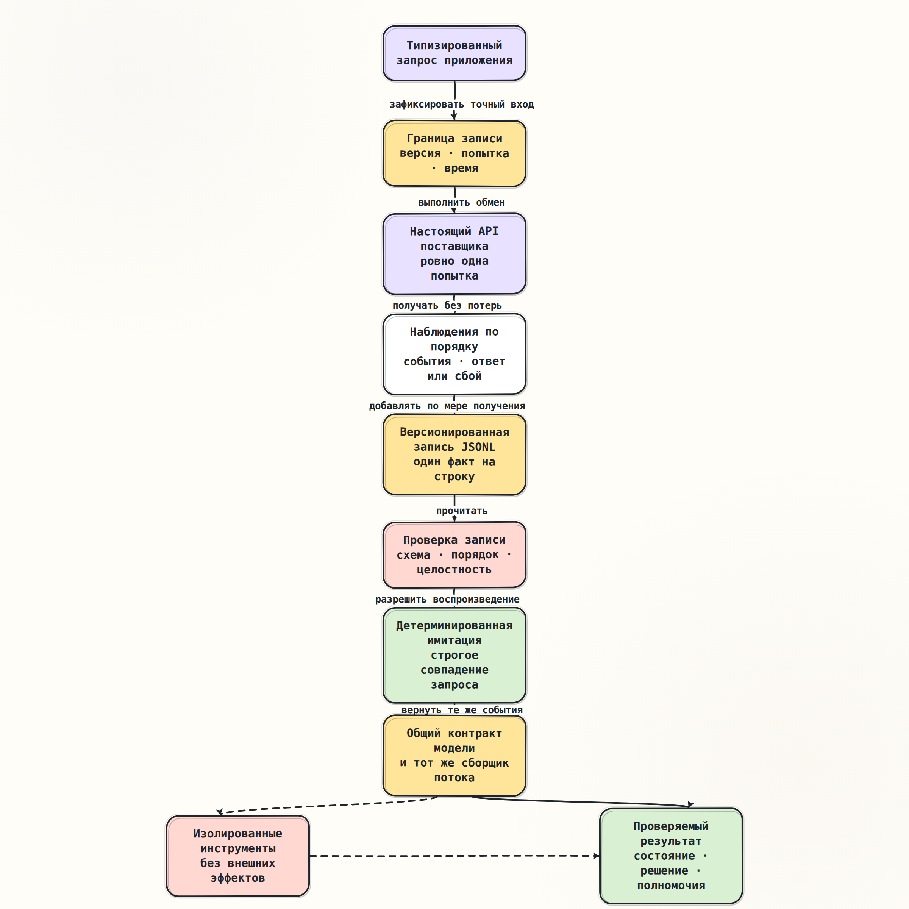

# Запись, воспроизведение и оценка

> [Основной план, промпт 1.6](../../docs/senior_ai_agent_engineer_2026.md#промпт-16-запись-воспроизведение-и-оценка)

## Краткое содержание

Запись сохраняет наблюдаемую границу одного обращения к языковой модели:
точный запрос, номер попытки, упорядоченные события, завершённый ответ либо
типизированный сбой, время и сведения об использовании. Воспроизведение читает
эту запись и возвращает те же наблюдения через обычный `ModelClient`, не
обращаясь в сеть. Оно проверяет логику сборщика, среды выполнения и агента, но
не повторяет внутреннее вычисление модели.

Детерминированное воспроизведение отвечает на вопрос «правильно ли система
обрабатывает уже известную трассу?». Повторная оценка через настоящий API
отвечает на другой вопрос: «с какой частотой текущая модель даёт приемлемый
результат на версии набора примеров?». Смешивать эти режимы нельзя: новый
запрос поставщику — это новая генерация, а не воспроизведение старой.

Для агента запись важна только как доказательство наблюдённого обмена. Она не
разрешает повторять вызов инструмента, не подтверждает внешний побочный эффект
и не заменяет каноническое состояние, журнал операций или контрольную точку.

## Ключевые понятия

| Понятие | Точное значение |
|---|---|
| Запись обмена | Версионированная последовательность фактов об одном логическом обращении и его попытках |
| Воспроизведение | Выдача сохранённых наблюдений без нового запроса поставщику |
| Детерминированная имитация | Реализация `ModelClient`, которая потребляет заранее заданные сценарии и отклоняет неожиданные вызовы |
| Трасса | Причинно упорядоченная история запроса, попыток, событий и итогового состояния обмена |
| Эталонный сценарий | Зафиксированный вход с ожидаемым типом результата и проверяемыми инвариантами |
| Проверяющее условие | Правило, которое превращает наблюдения в результат проверки: прошло или не прошло |
| Повторная оценка | Несколько новых вызовов настоящего API для оценки распределения качества, отказов, задержки и стоимости |
| Снимок окружения | Версии модели, API, адаптера, схем, настроек и данных, необходимые для объяснения результата |
| Относительное время | Смещение события от начала попытки по монотонным часам |
| Целостность записи | Возможность обнаружить пропущенные, переставленные, повреждённые или незавершённые строки |

## Основные идеи

### Три разных действия

Запись, воспроизведение и оценка используют похожие данные, но имеют разные
границы ответственности.

| Действие | Есть сеть | Создаётся новый ответ модели | Главный вопрос |
|---|---:|---:|---|
| Запись настоящего обмена | Да | Да | Что именно произошло на границе клиента модели? |
| Воспроизведение записи | Нет | Нет | Правильно ли код обрабатывает эту точную трассу? |
| Повторная оценка | Да | Да, в каждом повторе | Насколько часто текущая система удовлетворяет критериям? |

Повторить запрос с теми же сообщениями и настройками — не значит получить тот
же ответ. Даже если поставщик принимает настройку случайности, на результат
могут влиять версия модели, обслуживающая инфраструктура и недоступные клиенту
детали выполнения. Поэтому точное равенство допустимо как проверяющее условие
для записанной имитации, но обычно неверно как критерий качества настоящей
модели.

### Одна короткая трасса

Рассмотрим потоковый текстовый ответ.

```text
0 мс    exchange_started    точный ModelRequest и ModelAttempt(number=1)
18 мс   ResponseStarted     адаптер создал событие, response_id="resp-42"
31 мс   TextDelta           "Завтра "
39 мс   TextDelta           "дождь"
43 мс   OutputCompleted     TextOutput("Завтра дождь")
44 мс   UsageReported       input=120, output=3
45 мс   ResponseCompleted   адаптер подтвердил завершающий кадр поставщика
46 мс   exchange_finished   сборщик проверил ModelResponse
```

Обёртка на границе `ModelClient` пропускает нормализованные события вызывающей
стороне сразу, а не ждёт конца потока. Каждое событие она сначала добавляет в
хранилище с порядковым номером и относительным временем. Но эта потоковая
обёртка не объявляет весь обмен успешным: после проверенного
`ResponseCompleted` сборщик вправе немедленно закрыть источник. Успешную
строку `exchange_finished` записывает внешний слой только после того, как
`StreamingRuntime.collect` вернул проверенный `CollectedStream`.

В этом уроке граница записи проходит после преобразования сырого ответа
поставщика в типизированное событие, но до передачи события сборщику. Поэтому
нормализованное воспроизведение проверяет сборщик, среду выполнения и политику
агента. Оно не проверяет, правильно ли адаптер разобрал исходные сетевые
данные.

Здесь нужны два связанных, но разных артефакта:

1. Нормализованная запись обмена хранит `ModelRequest`, `ModelEvent`, итог или
   сбой. Именно её читает детерминированная реализация `ModelClient`.
2. Сырая имитация поставщика хранит его кадры и транспортный исход в
   поставщико-зависимой схеме. Её подают на вход адаптеру в отдельном тесте.

`ResponseCompleted` не является названием обязательного кадра поставщика. Это
событие общего контракта, которое адаптер создаёт лишь после получения
достаточного завершающего доказательства от конкретного API. Байты
`ProviderPayload`, приложенные к нормализованному событию, сохраняют
происхождение, но сами по себе не превращают его в сырую имитацию транспорта.

При воспроизведении детерминированная имитация сверяет входной `ModelRequest`,
выдаёт те же события в том же порядке и завершает поток тем же исходом.
Сборщик и агент получают тот же публичный договор, что и при настоящем API.
Внешний поставщик при этом не вызывается.



### Что обязана сохранять запись

Минимальная запись делится на пять групп.

#### 1. Идентичность и версия

- `schema_version` формата записи;
- `run_id`, `exchange_id`, `request_id` и номер попытки;
- версия приложения, адаптера и контракта `ModelClient`;
- поставщик, запрошенная и фактически ответившая модель;
- версия API и библиотеки поставщика, если они известны;
- идентификаторы ответа и запроса поставщика без секретов.

Без версии схема становится ловушкой: новое поле, значение перечисления или
тип события можно ошибочно прочитать по старым правилам. Читатель должен явно
поддерживать версию либо выполнить проверенное преобразование. Молча
игнорировать неизвестное завершающее состояние нельзя.

#### 2. Точный вход

- сообщения в исходном порядке и с сохранёнными ролями;
- определения инструментов и их схемы;
- запрошенный формат ответа;
- параметры генерации, ограничения выхода и требуемые возможности;
- выбранный маршрут и причины выбора, если маршрутизация была выполнена.

Хеш запроса полезен для поиска и проверки целостности, но не заменяет сам
запрос. По одному хешу невозможно воспроизвести сообщения, схему или порядок
инструментов. Напротив, секрет авторизации и транспортные заголовки по
умолчанию сохранять нельзя.

#### 3. Наблюдённые события

- точный тип каждого `ModelEvent`;
- `sequence`, индекс результата и идентификатор вызова инструмента;
- текстовые фрагменты и фрагменты аргументов без склейки между попытками;
- `OutputCompleted`, `UsageReported`, `UnknownProviderEvent`;
- байты `ProviderPayload`, приложенные адаптером как доказательство
  происхождения, их вид и тип содержимого;
- относительное время наблюдения и номер попытки.

Порядок событий является частью результата. Если хранить только собранный
текст, исчезнут границы результатов, поздние сведения об использовании,
неизвестные события и место обрыва. Такой файл годится для демонстрации
ответа, но не для контрактного воспроизведения.

Если нужно проверить само преобразование, создаётся отдельная сырая имитация
поставщика. Она не добавляется в точный вход `ModelRequest` и не смешивается с
нормализованными событиями в одной схеме воспроизведения.

#### 4. Завершение или сбой

У обмена должен быть ровно один подтверждённый итог верхнего уровня:

- `response` с проверенным `ModelResponse`;
- `error` с точным типом ошибки, этапом, кодом и безопасными полями;
- `cancelled` как отдельный сигнал вызывающей стороны;
- `interrupted` с точным префиксом событий и исходной причиной.

Текст исключения недостаточен: он нестабилен и не сохраняет ветвление
политики. Для `ModelRateLimited` нужен `retry_after_s`, для `ModelTimeout` —
этап, для `ModelTransportError` — признак полученных байтов, а для
`ModelStreamInterrupted` — точные уже наблюдённые события и причина.

Если поток оборвался после `TextDelta`, в записи нет искусственного
`ResponseCompleted`. При воспроизведении наружу снова должен выйти
`ModelStreamInterrupted`, а не неполный `ModelResponse`.

#### 5. Время и использование

- время начала по настенным часам для аудита и сопоставления систем;
- смещения событий и общая длительность по монотонным часам;
- исходный лимит времени или длительность до крайнего срока;
- число попыток и задержки между ними;
- входные, выходные, кэшированные и рассуждающие токены, если они сообщены;
- рассчитанная стоимость вместе с версией тарифа и валютой;
- признак отсутствующих данных, а не подстановка нуля.

Абсолютное значение монотонных часов непереносимо между процессами. В запись
нужно помещать разности и исходный временной лимит, а при воспроизведении
создавать новый локальный `Deadline`. Настенные часы не подходят для проверки
гонки тайм-аута: их может корректировать синхронизация времени.

### Почему здесь удобен JSONL

В формате JSONL каждая строка содержит одно законченное значение JSON в
UTF-8. Это удобно для добавления по мере получения потока, построчного чтения
и обработки больших наборов без загрузки всего файла в память.

```json
{"schema_version":1,"run_id":"run-7","record_type":"exchange_started","exchange_id":"ex-17","record_index":0,"recorded_at":"2026-08-13T06:00:00Z","request":{"request_id":"weather-17","model":"model-a"}}
{"schema_version":1,"run_id":"run-7","record_type":"model_event","exchange_id":"ex-17","record_index":1,"offset_ns":18000000,"event":{"type":"ResponseStarted","sequence":1}}
{"schema_version":1,"run_id":"run-7","record_type":"model_event","exchange_id":"ex-17","record_index":2,"offset_ns":31000000,"event":{"type":"TextDelta","sequence":2,"delta":"Завтра "}}
{"schema_version":1,"run_id":"run-7","record_type":"exchange_finished","exchange_id":"ex-17","record_index":7,"result":{"type":"response"},"duration_ns":46000000}
```

JSONL — соглашение, а не зарегистрированный IETF формат. RFC 7464 описывает
другой формат последовательностей JSON: перед каждым элементом стоит
управляющий разделитель записи, что позволяет найти следующий элемент после
повреждения. Обычная новая строка в JSONL проще для командной строки, но после
падения процесса последняя строка может остаться оборванной.

Для учебного средства запуска нужны дополнительные правила:

1. `record_index` непрерывно растёт внутри обмена.
2. Все строки несут `run_id`, `exchange_id` и `schema_version`.
3. Один писатель владеет файлом либо запись сериализуется через блокировку.
4. Последняя строка подтверждает итог; без неё обмен считается незавершённым.
5. Оборванный хвост помещается в карантин и явно сообщается, а повреждение в
   середине файла останавливает воспроизведение.
6. Ограничиваются размер строки, число событий, глубина JSON и общий объём.
7. Для долговечности задаётся политика сброса буфера и синхронизации с диском;
   один вызов `write` ещё не означает сохранение после сбоя питания.

Если нужна защита от незаметного изменения, строки можно связать цепочкой
SHA-256 либо подписать завершённый обмен. Для хеша структурированного JSON
нужна одна явно выбранная каноническая сериализация, например правила RFC
8785. Исходные байты поставщика при этом хешируются как байты: разбор и
повторная сериализация способны изменить представление.

### Строгое воспроизведение

Имитация должна ошибаться громко, когда сценарий и код разошлись.

- Каждый вызов потребляет ровно один сценарий.
- Число и порядок вызовов проверяются.
- В строгом режиме сравнивается весь `ModelRequest`: модель, сообщения,
  инструменты, схемы и формат ответа.
- Допустимая замена корреляционного идентификатора оформляется отдельной
  явной политикой; она не должна скрывать изменение смыслового входа.
- `ResponseStarted` и `ResponseCompleted` сверяются с идентификатором запроса.
- Структурированный результат повторно проходит проверку схемы.
- Лишний вызов даёт `UnexpectedModelCall`, а оставшийся сценарий после теста
  означает, что ожидаемый вызов не состоялся.

В текущем репозитории эти свойства уже частично задаёт
[`ScriptedModelClient`](../../lessons/module_01_provider_contract/implementation/scripted_client.py):
он потребляет заранее объявленные ответы и потоки по одному, проверяет связь с
запросом и не делает скрытых повторов. Тема 1.6 добавит долговечную
сериализацию, чтение JSONL и средство запуска поверх этого контракта.

### Два режима времени

Для большинства контрактных тестов полезен быстрый режим: события выдаются в
записанном порядке без реальных ожиданий. Тест остаётся быстрым и проверяет
смысловую последовательность.

Для тайм-аутов, отмены и гонок нужен режим виртуального времени. Записанные
смещения управляют ручными часами и точками блокировки. Тест явно продвигает
время, посылает отмену или освобождает источник. Реальный `sleep` делает такой
тест медленным и нестабильным, а простая выдача всех событий сразу уничтожает
исследуемую гонку.

Отмена — внешнее событие, а не ответ модели. Чтобы воспроизвести её границу,
нужно зафиксировать момент запроса на отмену относительно заблокированного
чтения и проверить, что `CancelledError` дошёл до источника. Запись одного
текста «операция отменена» этого не доказывает. Сохранённый статус отмены
описывает исход первоначального запуска, но не заменяет активную отмену задачи
в тесте. Так же и тайм-аут проверяется блокировкой и продвижением ручных часов,
а не мгновенной выдачей заранее созданного `ModelTimeout`.

### Матрица обязательных сценариев

| Сценарий | Что хранится | Главное проверяющее условие |
|---|---|---|
| Обычный ответ | Запрос, нормализованные события, ответ, использование | Тот же тип и порядок результатов без сети |
| Нарушенная структура | Сырая имитация для адаптера; отдельно типизированный сбой обмена | Адаптер выдаёт `ModelProtocolError`, а ниже по стеку нет успешного `StructuredOutput` |
| Вызов инструмента | Полные события, `call_id`, имя, исходные и разобранные аргументы | Предложение появляется только после подтверждённого завершения |
| Частичный поток | Точный префикс событий и причина обрыва | Нет искусственного `ResponseCompleted` и нет склейки попыток |
| Тайм-аут | Этап, лимит времени, события до границы | Возвращается `ModelTimeout` либо `ModelStreamInterrupted` по наблюдённой границе |
| Отмена | Момент отмены и состояние источника | Отмена передаётся выше, источник закрывается, новой попытки нет |
| Ограничение частоты | Попытки, `retry_after_s`, общий крайний срок | Повтор укладывается в общий лимит и начинается только по политике |
| Нет сведений об использовании | Явное `usage=null` | Стоимость остаётся неизвестной, а не нулевой |

Нарушенный структурированный ответ особенно важен. Если конструктор
`StructuredOutput` уже проверяет согласованность JSON, неверные байты нельзя
сначала превратить в «успешную» модель, а потом отметить флагом. Сырая
имитация сохраняет вход адаптера, а нормализованная запись обмена — его
типизированный сбой. Общий идентификатор позволяет сопоставить артефакты, но
каждый воспроизводится на своей границе.

### Причинная связь с агентом

Механизм влияет на агента через наблюдаемый результат, а не через сам факт
наличия файла.

1. Воспроизводится `ResponseCompleted` с вызовом инструмента → появляется
   подтверждённое предложение → политика заново проверяет схему и полномочия.
2. Воспроизводится `ModelStreamInterrupted` → агент остаётся без завершённого
   решения → вызов инструмента запрещён.
3. Воспроизводится `ModelTimeout` до первого события → политика верхнего уровня
   может выбрать новую попытку в пределах лимита → номер и причина попытки
   должны стать отдельными наблюдениями.
4. Воспроизводится отмена → работа прекращается и ресурсы освобождаются →
   скрытое продолжение или повтор считается нарушением.

Главный инвариант: воспроизведение одних и тех же наблюдений приводит к тому же
переходу состояния агента и тому же решению о полномочиях, но не совершает
настоящий внешний побочный эффект.

Вызов инструмента в записи — предложение модели, а не команда на повторное
исполнение. В тестах используются изолированные имитации инструментов, которые
только проверяют аргументы и считают вызовы. Для интеграционной проверки нужен
отдельный тестовый арендатор, идемпотентный ключ и явное разрешение; запись
сама по себе таких полномочий не даёт.

### Контрактные тесты и повторные оценки

| Свойство | Детерминированное воспроизведение | Повторная оценка через API |
|---|---|---|
| Изменчивость | Отсутствует при неизменной записи и коде | Ожидаема между запусками |
| Скорость | Высокая, сеть не нужна | Ограничена сетью и поставщиком |
| Стоимость модели | Нулевая | Возникает при каждом повторе |
| Проверяемое условие | Точное событие, тип ошибки, переход состояния, число вызовов | Доля успешных случаев, распределение оценок, отказов, задержки и стоимости |
| Находит | Регрессии контракта, обработки отказов, полномочий и порядка | Изменение качества модели, маршрута, инструкции или поставщика |
| Не доказывает | Текущее качество и поведение настоящего API | Полную воспроизводимость редких гонок и всех ветвей кода |

Надёжный контур проверки использует оба слоя:

1. При каждом изменении запускаются быстрые контрактные тесты на зафиксированных
   успешных, ошибочных и безопасностных трассах.
2. По расписанию или перед выпуском запускается версионированный набор примеров
   через настоящий API.
3. Каждый пример повторяется несколько раз; сохраняются все исходы, а не
   только среднее значение.
4. Результаты сравниваются с заранее объявленным порогом и предыдущей
   сопоставимой версией.
5. Новая реальная регрессия после разбора превращается в минимальную запись и
   добавляется в детерминированный набор.

Для повторной оценки фиксируют версию набора, инструкцию, схемы, маршрут,
запрошенную и фактическую модель, настройки, число повторов и версию
проверяющего условия. Полезны доля выполнения задачи, доля допустимой
структуры, частота отказов и неверных вызовов инструмента, медиана и 95-й
процентиль задержки, токены и стоимость. Среднее без числа наблюдений и
распределения скрывает редкие опасные исходы.

### Телеметрия не заменяет запись воспроизведения

Распределённая трассировка помогает связать обмен с остальной системой.
`trace_id`, `span_id`, `request_id` и `exchange_id` должны позволять найти
соответствующие данные без помещения пользовательского текста в имя события
или атрибут высокой размерности.

`OpenTelemetry` рекомендует представлять повторяющиеся значимые происшествия
как события, а свойства всей операции — как атрибуты интервала. Соглашения для
генеративных моделей определяют поля поставщика, модели, токенов, входных и
выходных сообщений, но предупреждают, что сообщения и аргументы инструментов
могут содержать персональные и конфиденциальные данные. Эти поля не следует
включать по умолчанию.

На 13 августа 2026 года соглашения `OpenTelemetry` для генеративных моделей
имеют статус разработки и вынесены в отдельный официальный проект. Их можно
использовать для сопоставимой телеметрии, но нельзя делать неявной схемой
долговечной записи. Формат воспроизведения должен версионироваться самим
приложением. Телеметрия также может собираться выборочно и объединять
несколько попыток в одну логическую операцию, тогда как эталон сохраняет
каждую попытку отдельно.

Стандарт W3C для контекста трассировки предназначен для корреляции.
`traceparent` и
`tracestate` не должны содержать персональные или иные чувствительные данные.
Идентификатор трассы не заменяет `exchange_id`: один агентный запуск может
содержать несколько попыток и обращений к модели.

### Конфиденциальность и доверие

Записи часто содержат больше чувствительных данных, чем обычные журналы:
системные инструкции, переписку, найденные документы, аргументы и результаты
инструментов, исходные ответы поставщика. Полная запись по умолчанию — плохая
политика для промышленной среды.

Нужны явные решения:

- минимальный режим метаданных без содержимого;
- отдельное согласие или список разрешённых наборов для полной записи;
- удаление секретов до сохранения;
- шифрование при передаче и хранении;
- разграничение по арендаторам и служебным ролям;
- срок хранения, удаление по запросу и журнал доступа;
- регион хранения и запрет переноса через границы доверия;
- версия политики очистки и отметка, какие поля были изменены.

Очистка данных создаёт компромисс. После замены значения точное
воспроизведение может стать невозможным. Практичный вариант — хранить
минимальную очищенную трассу для большинства тестов, а полный зашифрованный
артефакт — только для специально разрешённых случаев с коротким сроком. Хеш
секрета тоже может раскрывать малое пространство возможных значений, поэтому
он не является универсальной анонимизацией.

Файл воспроизведения считается недоверенным входом. Читатель проверяет схему,
типы, размеры, последовательность, область арендатора и целостность до
создания объектов. Нельзя выбирать класс по произвольному имени из файла,
вызывать `eval`, загружать модуль по строке или исполнять записанный инструмент
без отдельной политики.

## Примеры

### Два уровня фиксации исхода

Записывающая сторона должна сохранять событие до передачи управления
потребителю либо иметь надёжную очередь, иначе падение потребителя создаст
разрыв между тем, что он увидел, и тем, что осталось в записи.

```python
class RecordingClient:
    def stream(self, request, *, attempt):
        return self._record_attempt(request, attempt)

    async def _record_attempt(self, request, attempt):
        await self.writer.attempt_started(attempt)
        try:
            async for event in self.inner.stream(request, attempt=attempt):
                await self.writer.event(event, self.clock.elapsed_ns())
                yield event
        except Exception as error:
            await self.writer.attempt_failed(attempt, error)
            raise
```

Потоковая обёртка ловит `Exception`, но не `GeneratorExit` и не отмену.
Поэтому штатное закрытие генератора сборщиком не превращается в ложный сбой.
Ошибка промежуточной попытки фиксируется до того, как среда выполнения решит,
допустим ли повтор.

Итог всего обмена фиксирует операция, которая ожидает результат сборщика:

```python
async def collect_recorded(runtime, client, request, deadline, writer, clock):
    await writer.exchange_started(request, deadline)
    recorded_client = RecordingClient(client, writer, clock)
    try:
        result = await runtime.collect(
            recorded_client, request, deadline=deadline
        )
    except asyncio.CancelledError:
        await writer.exchange_cancelled(clock.elapsed_ns())
        raise
    except Exception as error:
        await writer.exchange_failed(error, clock.elapsed_ns())
        raise
    await writer.exchange_succeeded(result.response, clock.elapsed_ns())
    return result
```

Отмена остаётся отдельным исходом внешней операции, а успех появляется только
после возврата проверенного результата.

Это лишь форма границы: конструктор и поля опущены. Промышленная реализация
отдельно решает обратное давление, долговечность, очистку содержимого и
поведение при сбое самого хранилища. Нельзя без обсуждения сделать запись
синхронной зависимостью доступности модели или, наоборот, терять обязательный
аудит без сигнала.

### Проверка, что сеть не использовалась

```python
replay = RecordedModelClient.from_jsonl(path, network=ForbiddenNetwork())

result = await StreamingRuntime(time=ManualTime()).collect(
    replay,
    recorded_request,
    deadline=local_deadline,
)

assert result.response == expected_response
assert replay.remaining == 0
assert fake_tool.calls == []
```

Запрет сети является частью проверяющего условия, а не предположением. Для
сценария с подтверждённым предложением инструмента `fake_tool.calls` может
содержать один проверенный вызов; настоящая интеграция при этом недоступна.

### Шаблон результата повторной оценки

| Показатель | Текущая версия | Предыдущая версия | Порог |
|---|---:|---:|---:|
| Выполнение задачи | 94 из 100 | 96 из 100 | не ниже 92 из 100 |
| Допустимая структура | 100 из 100 | 100 из 100 | 100 из 100 |
| Опасный вызов инструмента | 0 из 300 повторов | 0 из 300 | ровно 0 |
| 95-й процентиль задержки | 2,8 с | 2,4 с | не выше 3,0 с |
| Средняя стоимость случая | 0,012 условной единицы | 0,010 | не выше 0,015 |

Числа здесь иллюстративны. Настоящий отчёт обязан ссылаться на сырые записи,
версию набора, число повторов и формулу каждого показателя. Для критического
безопасностного свойства средняя оценка неприемлема: один опасный вызов уже
может означать провал.

### Будущая практика после команды `к практике`

Практическая часть добавит:

1. версионированные модели строк JSONL;
2. записывающий адаптер поверх общего `ModelClient`;
3. строгий `RecordedModelClient` без сети;
4. быстрый режим и режим ручного времени;
5. сценарии обычного ответа, неверной структуры, вызова инструмента,
   частичного потока, тайм-аута и отмены;
6. средство запуска набора, сохраняющее события, итог, задержку и
   использование;
7. таблицу сравнения контрактных тестов и повторных вызовов настоящего API.

До команды `к практике` код этого механизма не создаётся: сначала обсуждаем
границы записи, доверия и проверяющие условия.

## Заметки и наблюдения

### Инварианты формата

- Каждая строка либо полностью допустима по известной версии, либо запись не
  участвует в воспроизведении.
- `record_index` не повторяется и не уменьшается внутри обмена.
- Каждое событие принадлежит ровно одной попытке и одному обмену.
- После подтверждённого итогового состояния новые события этой попытки
  запрещены.
- `ResponseCompleted` записывается как нормализованное событие лишь после того,
  как адаптер получил завершающее доказательство поставщика; записывающий слой
  не имеет права его додумывать.
- Префикс оборванного потока сохраняется без преобразования в успешный ответ.
- Неизвестные данные поставщика сохраняются и не становятся разрешением на
  действие.
- Удаление файла воспроизведения не меняет каноническое состояние агента и не
  отменяет уже совершённый побочный эффект.

### Границы доказательства

Записанная трасса доказывает поведение кода только на своём наборе наблюдений.
Она не доказывает:

- что настоящий поставщик сегодня вернёт тот же ответ;
- что записанный набор покрывает все возможные события и гонки;
- что исходные часы и сетевые задержки повторены физически;
- что внешний инструмент действительно выполнил действие;
- что очищенные данные эквивалентны исходным для всех ветвей;
- что проверяющее условие правильно отражает пользовательское качество.

Набор записей устаревает. Его нужно пересматривать при изменении контракта,
адаптера, схем инструментов, политики безопасности и реального распределения
запросов. Автоматическая перезапись эталона после падения теста уничтожает
смысл проверки: изменение сначала разбирается человеком.

### Связь с текущим кодом

- [`contracts.py`](../../lessons/module_01_provider_contract/implementation/contracts.py)
  уже хранит точные байты `ProviderPayload`, типы результатов, сведения об
  использовании, потоковые события и категории ошибок.
- [`stream_assembly.py`](../../lessons/module_01_provider_contract/implementation/stream_assembly.py)
  проверяет порядок и собирает `ModelResponse` только после корректного
  завершения.
- [`scripted_client.py`](../../lessons/module_01_provider_contract/implementation/scripted_client.py)
  даёт детерминированную имитацию в памяти и отклоняет неожиданный вызов.
- [`execution.py`](../../lessons/module_01_streaming_cancellation/implementation/execution.py)
  задаёт попытки, единый крайний срок и ограниченный повтор до первого
  события.
- [`testing.py`](../../lessons/module_01_streaming_cancellation/implementation/testing.py)
  содержит ручные часы, блокировки, явные сбои и учёт закрытых попыток.

Тема 1.6 не должна создавать второй несовместимый протокол. Долговечная запись
сериализует эти общие модели и снова подаёт их в тот же сборщик.

## Вопросы для повторения

1. Чем воспроизведение записи отличается от нового запроса с теми же
   сообщениями?
2. Почему одного итогового текста недостаточно для воспроизведения потокового
   обмена?
3. Как представить обрыв после нескольких событий, не создав ложный успех?
4. Какие временные значения переносимы между процессами, а какие нет?
5. Почему JSONL нуждается в собственной завершающей строке и проверке
   оборванного хвоста?
6. Какие поля нужны, чтобы отличить ошибку протокола от тайм-аута и отмены?
7. Почему записанный вызов инструмента не разрешает повторять внешний
   побочный эффект?
8. Что доказывает детерминированный тест и что может доказать только повторная
   оценка через настоящий API?
9. Какие данные нельзя помещать в `traceparent`, `tracestate` и обычную
   телеметрию?
10. Как очистка конфиденциальных данных меняет точность воспроизведения?

## Итоги

Корректная нормализованная запись сохраняет не «ответ модели», а
версионированный договор всего обмена: точный вход, попытку, события с данными
об их происхождении, завершение или сбой, время и использование.
Воспроизведение возвращает эти наблюдения через тот же `ModelClient` без сети
и без настоящих инструментов. Сырая имитация для проверки адаптера остаётся
отдельным артефактом со своей поставщико-зависимой схемой.
Его задача — делать контрактные, отказоустойчивые и безопасностные проверки
быстрыми и точными.

Настоящее качество модели проверяется отдельно повторными оценками. Они
создают новые ответы, стоят денег и требуют распределений, версий данных и
заранее объявленных порогов. Вместе оба слоя дают полезную петлю: реальный
сбой превращается в минимальную запись, запись — в детерминированную
регрессионную проверку, а периодическая оценка продолжает следить за изменчивой
внешней системой.

Для агента правило остаётся строгим: запись может доказать наблюдённый переход,
но не выдаёт полномочия на инструмент и не заменяет журнал побочных эффектов.
После теории останавливаемся для вопросов; к реализации переходим только по
команде `к практике`.

## Источники

- [Формат JSON, RFC 8259](https://www.rfc-editor.org/rfc/rfc8259.html) — грамматика JSON и требования к генератору.
- [Описание JSONL](https://jsonlines.org/) — UTF-8 и одно допустимое значение JSON на строку; проверено 13 августа 2026 года.
- [Последовательности JSON, RFC 7464](https://www.rfc-editor.org/rfc/rfc7464.html) — разделитель записей, восстановление после повреждённого элемента и обнаружение оборванных значений.
- [Канонизация JSON, RFC 8785](https://www.rfc-editor.org/rfc/rfc8785.html) — стабильное представление для хеширования и подписи.
- [События OpenTelemetry](https://opentelemetry.io/docs/specs/semconv/general/events/) — отличие события от атрибута операции; статус проверен 13 августа 2026 года.
- [Официальные соглашения `OpenTelemetry` для генеративных систем](https://github.com/open-telemetry/semantic-conventions-genai/blob/main/docs/gen-ai/gen-ai-spans.md) — логическая операция, повторные попытки и чувствительное содержимое; статус проверен 13 августа 2026 года.
- [Официальная документация OpenAI по оценкам](https://developers.openai.com/api/docs/guides/evaluation-best-practices) — сочетание показателей с человеческой проверкой, предметные сценарии и непрерывная оценка; проверено 13 августа 2026 года.
- [Стандарт W3C для контекста трассировки](https://www.w3.org/TR/trace-context/) — корреляция распределённой трассы и запрет помещать персональные данные в `traceparent` и `tracestate`.
- [Python 3.13: монотонные часы](https://docs.python.org/3.13/library/time.html#time.monotonic_ns) — переносимы разности показаний, а не исходная точка часов.
- [Python 3.13: отмена задач](https://docs.python.org/3.13/library/asyncio-task.html#task-cancellation) — передача `CancelledError` и освобождение ресурсов.
