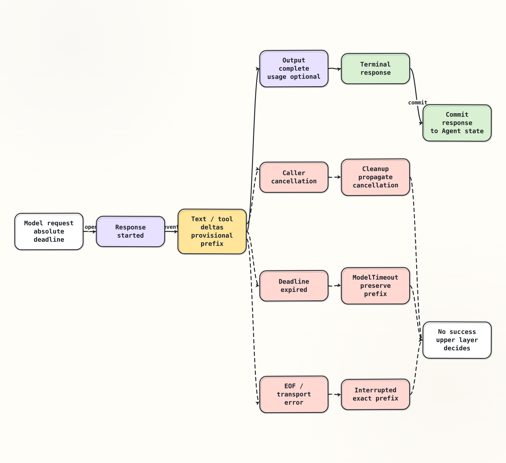

# Потоковый ответ и отмена

> [Основной план, промпт 1.3](../../docs/senior_ai_agent_engineer_2026.md#промпт-13-потоковый-ответ-и-отмена)

## Краткое содержание

Streaming response — это не постепенно растущий `ModelResponse`, а
упорядоченная последовательность предварительных `ModelEvent` и один
terminal outcome. `TextDelta` можно показать как provisional preview, но
нельзя фиксировать как завершённый ход Agent; частичные аргументы `tool`
нельзя исполнять. Cancellation, deadline и transport interruption завершают
ожидание по разным причинам и требуют разных решений runtime. Retry всегда
создаёт новую модельную попытку, поэтому он расходует новый budget и может
изменить текст или `tool call`.

## Ключевые понятия

- **Observed prefix** — точная последовательность уже полученных events. Она
  полезна для UI, аудита и диагностики, но не является terminal response.
- **Terminal event** — событие, после которого результат больше не меняется.
  В текущем общем контракте это `ResponseCompleted`.
- **Provisional state** — обратимое представление незавершённого ответа,
  например streaming preview в UI. Это не committed Agent state.
- **Interruption** — stream закончился без terminal event из-за EOF,
  transport failure или другой ошибки чтения.
- **Caller cancellation** — вызывающая сторона больше не хочет продолжать
  операцию. В `asyncio` это кооперативный сигнал `CancelledError`.
- **Deadline** — абсолютный момент окончания общего временного budget, а не
  новый локальный timeout на каждом слое.
- **Backpressure** — ограничение скорости чтения скоростью downstream
  consumer, чтобы очередь events и память не росли без границ.
- **Retry budget** — общий предел attempts, времени и стоимости. Он важнее
  желания отдельного adapter «попробовать ещё раз».

## Основные идеи

### Один stream, две шкалы состояния

Transport может уже передать десятки chunks, пока semantic response всё ещё
не завершён. Поэтому runtime ведёт два разных представления:

1. `observed_events` растёт после каждого проверенного event;
2. `committed_response` остаётся пустым до `ResponseCompleted`.

Это различие защищает Agent от преждевременного решения. Видимый текст можно
отменить или пометить незавершённым. Исполненный `tool` уже мог изменить
внешнюю систему, поэтому partial `ToolArgumentsDelta` остаётся только строкой
до `OutputCompleted`, terminal event и проверки полномочий.



Главный инвариант: ни EOF, ни cancellation, ни deadline не создают
синтетический `ResponseCompleted`. Только настоящий terminal event разрешает
перенести response из provisional state в committed Agent state.

### Жизненный цикл успешного ответа

1. Runtime формирует `ModelRequest`, attempt identity и один абсолютный
   `deadline`.
2. Adapter открывает stream; `ResponseStarted` связывает его с request и
   provider response.
3. `TextDelta` и `ToolArgumentsDelta` расширяют observed prefix. Event order,
   provider identity и output index проверяются сразу.
4. `OutputCompleted` доказывает целостность конкретного output. Для streamed
   JSON собранные chunks должны совпасть с полным raw value.
5. `UsageReported` может появиться поздно либо отсутствовать.
6. `ResponseCompleted` сверяет request/provider identity, completed outputs и
   reported usage. Сам `ModelResponse` дополнительно проверяет допустимое
   сочетание `outcome` и output variants. Только после этого runtime получает
   terminal result для следующего шага Agent.

`ResponseOutcome.TRUNCATED` тоже terminal: provider закончил генерацию из-за
лимита. Это неполный результат LLM, но не transport exception. Решение
увеличить token limit, запросить continuation или выбрать другую модель
принадлежит Agent runtime и создаёт новый exchange.

### Cancellation и deadline — не одно и то же

Оба механизма могут технически отменить ожидающую coroutine, но выражают
разный intent:

- внешний `CancelledError` означает «caller больше не ждёт»; adapter закрывает
  источник в `finally`, пробрасывает cancellation и не делает hidden retry;
- истёкший `deadline` означает «общий time budget исчерпан»; boundary
  классифицирует исход как `ModelTimeout` и сохраняет phase/prefix для
  решения runtime;
- если timeout случился после events, итог остаётся interrupted prefix, а не
  completed response.

Deadline должен передаваться как абсолютное значение, измеренное monotonic
clock. Иначе transport, чтение stream и каждый retry получают полный timeout
заново, а реальная операция превышает обещанный пользователю budget.

В Python 3.13 `asyncio.timeout_at(deadline)` использует абсолютное время event
loop. Контекст применяет cancellation внутри и преобразует именно своё
истечение в `TimeoutError` снаружи; обычный `CancelledError` нельзя поглощать,
иначе ломаются cleanup и structured concurrency.

### `429` и `Retry-After`

HTTP `429 Too Many Requests` сообщает о rate limiting. `Retry-After` — server
hint о том, как долго следует подождать; это не гарантия успеха и не разрешение
игнорировать общий budget.

Runtime может повторить exchange, только если одновременно выполнены условия:

- retry разрешён политикой для этой фазы;
- попытки и ожидаемая стоимость укладываются в retry budget;
- ожидание вместе с новой попыткой помещается в оставшийся deadline;
- sleep прерывается caller cancellation;
- предыдущая попытка не создала terminal Agent transition или внешний side
  effect.

Adapter должен вернуть typed `ModelRateLimited(retry_after_s=...)`, а решение
об ожидании оставить orchestration layer. При отсутствующем или invalid
`Retry-After` runtime применяет bounded backoff с jitter; если server hint
длиннее оставшегося deadline, корректный исход — timeout, а не ожидание сверх
budget.

### Что означает безопасный retry

Здесь «безопасный» означает прежде всего отсутствие повторного внешнего side
effect. Даже чистая генерация LLM при одинаковом request может дать другой
ответ, другую стоимость и другую latency.

| Наблюдение | Решение runtime |
|---|---|
| `429` до первого event | Bounded retry допустим после `Retry-After`, если хватает deadline и budgets |
| Deadline до первого event | Внутри этой операции retry невозможен: budget исчерпан. Только новый upper-level exchange с новым deadline и policy |
| Обрыв после text delta | Сохранить/пометить prefix; новый stream не дописывать к старому |
| Обрыв внутри tool arguments | Не парсить и не исполнять partial JSON; новый attempt должен начать proposal заново |
| Caller cancellation | Cleanup и `CancelledError` наверх; автоматический retry запрещён |
| Terminal `TRUNCATED` | Не transport retry; отдельное решение о continuation, fallback или stop |
| `usage=None` | Не retry; стоимость остаётся неизвестной, а не нулевой |

Если preview уже показан пользователю, новая попытка должна заменить его или
начать отдельный ответ с явной маркировкой. Молчаливое склеивание old prefix и
new stream создаёт текст, которого не выдавал ни один model exchange.

### Причинная связь с Agent

- `TextDelta` → меняется только provisional UI → `tool` недоступен → обрыв не
  создаёт внешнего эффекта.
- `OutputCompleted` → output целостен, но весь response ещё не terminal →
  runtime продолжает ждать → параллельные outputs и usage не теряются.
- `ResponseCompleted` → появляется committed `ModelResponse` → Agent может
  принять следующее решение или передать завершённый `tool call` executor.
- Cancellation/deadline/interruption → committed response отсутствует → retry
  решает runtime по общей policy → adapter не скрывает новый model decision.

## Примеры

### Provisional preview без преждевременного commit

```python
async def preview(source):
    async for event in source:
        audit.append(event)
        if isinstance(event, TextDelta):
            ui.preview(event.delta)  # reversible, not Agent state
        yield event

collected = await collect_stream(preview(client.stream(request)))
state.commit(collected.response)  # only after lifecycle validation
```

Если после `TextDelta("Возьмите зон")` соединение оборвалось, UI может показать
незавершённый prefix, но history Agent не получает обычный assistant message.
Если terminal response имеет `outcome=TRUNCATED` и `usage=None`, state честно
сохраняет оба факта: ответ неполон, стоимость неизвестна.

### Один абсолютный deadline

Ниже — sketch целевого orchestration, а не уже реализованный interface темы
1.2:

```python
async def collect_before(client, request, *, deadline):
    try:
        async with asyncio.timeout_at(deadline):
            return await collect_stream(client.stream(request))
    except asyncio.CancelledError:
        raise  # caller intent must survive unchanged
    except TimeoutError as exc:
        raise ModelTimeout("stream deadline expired", cause=exc) from exc
```

В практике контракт будет расширен так, чтобы deadline доходил до adapter и
transport, а timeout после prefix сохранял наблюдённые events. Одной внешней
обёртки недостаточно, если нижний transport продолжает работу или hidden
retry.

## Заметки и наблюдения

### Что уже доказано темой 1.2

- [`collect_stream`](../../lessons/module_01_provider_contract/implementation/stream_assembly.py)
  проверяет start, непрерывный sequence, output completion и единственный
  terminal response.
- Ошибка source типа `ModelClientError` после events сохраняется как
  `ModelStreamInterrupted(events, cause)`; clean EOF после prefix также не
  становится успехом. Произвольные исключения source этим контрактом пока не
  нормализуются.
- `CancelledError` проходит без wrapping; тест с blocked read подтверждает
  выполнение cleanup источника.
- Контракт уже различает `ModelRateLimited.retry_after_s`,
  `ResponseOutcome.TRUNCATED` и `usage=None`.

### Чего текущая реализация пока не доказывает

- `ModelClient` ещё не принимает deadline или execution context; transport и
  retry wait не делят один временной budget.
- Нет fake clock, delayed events и fault tests для timeout до/после prefix,
  `429`, terminal `TRUNCATED` и streaming response без usage.
- Локальное закрытие async generator не доказывает remote cancellation,
  остановку provider compute или отсутствие billing.
- При caller cancellation prefix пока не возвращается из `collect_stream`;
  для аудита events нужен отдельный sink/checkpoint до точки отмены.
- Protocol error, обнаруженный самим collector после уже принятых events, не
  всегда упакован в `ModelStreamInterrupted`; эту границу нужно унифицировать.
- `collect_stream` буферизует все events и chunks; bounded memory и
  end-to-end backpressure ещё не измерены.
- Общего механизма resume с последнего delta нет. Повтор начинает новый
  exchange, а `request_id` обеспечивает correlation, но не idempotency.

### Гонки на terminal boundary

Cancellation может прийти почти одновременно с terminal event. Runtime нужна
одна атомарная точка commit: если validated `ResponseCompleted` уже
зафиксирован, response terminal; если раньше зафиксирована cancellation,
успех не синтезируется задним числом. Реализация и тест этой гонки относятся к
практической фазе.

## Вопросы для повторения

1. Почему полученный text prefix ещё не является `ModelResponse`?
2. Как partial `ToolArgumentsDelta` может превратить transport bug в опасный
   side effect?
3. Почему внешний cancellation нельзя автоматически преобразовать в timeout?
4. Зачем передавать один absolute deadline через transport и retry wait?
5. Когда `429` допускает retry и почему `Retry-After` недостаточно само по
   себе?
6. Почему `TRUNCATED` — terminal result, а не transport failure?
7. Что обязан сохранить runtime, если usage отсутствует?
8. Почему новый stream нельзя продолжить с последнего text delta без явной
   поддержки resume protocol?

## Итоги

Streaming уменьшает time to first visible token, но усложняет границу commit.
Observed prefix принадлежит provisional state; только validated terminal event
создаёт `ModelResponse`. Cancellation сохраняет intent caller, deadline
ограничивает всю операцию, а interruption сохраняет неоднозначный prefix.
Retry остаётся явным решением runtime с общими time/attempt/cost budgets и не
маскируется под продолжение потока.

После команды `к практике` мы расширим собственный adapter без framework:
передадим deadline и cancellation до source, добавим deterministic clock и
fault cases для interruption, `429`, token limit и missing usage, затем
разберём успешную cancellation и неоднозначный partial response.

## Источники

Изменчивые детали Python проверены `2026-08-02` для Python `3.13.14`; HTTP
семантика сверена по RFC в ту же дату:

- [Python 3.13: task cancellation](https://docs.python.org/3.13/library/asyncio-task.html#task-cancellation)
- [Python 3.13: timeouts and `asyncio.timeout_at`](https://docs.python.org/3.13/library/asyncio-task.html#timeouts)
- [RFC 6585: `429 Too Many Requests`](https://www.rfc-editor.org/rfc/rfc6585.html#section-4)
- [RFC 9110: `Retry-After`](https://www.rfc-editor.org/rfc/rfc9110.html#section-10.2.3)
- [Основной план: промпт 1.3](../../docs/senior_ai_agent_engineer_2026.md#промпт-13-потоковый-ответ-и-отмена)
- [Контракты `ModelEvent`, outcomes и errors](../../lessons/module_01_provider_contract/implementation/contracts.py)
- [Текущий stream assembler](../../lessons/module_01_provider_contract/implementation/stream_assembly.py)
- [Deterministic stream tests](../../lessons/module_01_provider_contract/tests/test_stream_assembly.py)
- [Конспект 1.2: provider-neutral contract](../module_01_provider_contract/module_01_provider_contract.md)
