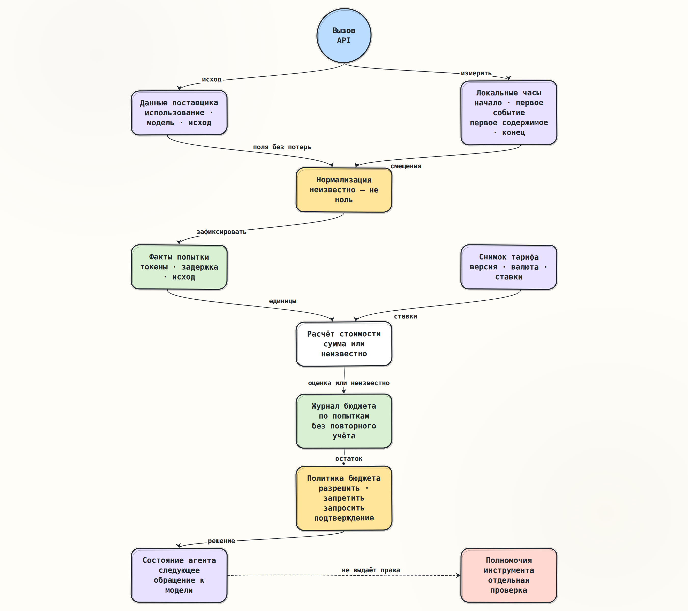

# Учёт токенов, задержки и стоимости

> [Основной план, модуль 1](../../docs/senior_ai_agent_engineer_2026.md#модуль-1-среда-выполнения-llm-и-абстракция-поставщика)

## Краткое содержание

Число токенов в контексте, сведения об использовании (`usage`) в ответе
поставщика и сумма в счёте — три связанные, но не тождественные величины.
Адаптер обязан сохранить исходные
поля без потерь, среда выполнения — измерить задержку локальными монотонными
часами, а расчётчик стоимости — применить версионированный снимок тарифа.

Учёт ведётся по каждой фактически начатой попытке. Отсутствующие сведения не
равны нулю, повтор не стирает расход первой попытки, а итоговая стоимость
приложения остаётся оценкой до сверки со счётом поставщика. Бюджет хранится
вне языковой модели: он может запретить следующее обращение или потребовать
подтверждение, но сам по себе не даёт полномочий на вызов инструмента.

## Ключевые понятия

| Понятие | Точное значение |
|---|---|
| Занятость контекста | Число единиц входа, которые конкретная модель должна уместить в своём окне; это ограничение запроса, а не счёт |
| Наблюдённое использование | Поля, которые поставщик вернул для одной попытки: вход, выход и доступные разбиения |
| Тарифицируемая единица | Категория, к которой применяется отдельная ставка: обычный вход, чтение или запись кэша, выход, изображение, аудио, вызов размещённого инструмента и другие позиции |
| Попытка | Одно фактически начатое обращение к API поставщика с собственным исходом, временем и использованием |
| Логический обмен | Операция приложения, которая может включать несколько попыток из-за разрешённых повторов или резервного маршрута |
| Время до первого события | Интервал от начала локального обращения до первого кадра протокола |
| Время до первого содержимого | Интервал до первого фрагмента, который можно показать пользователю; служебное событие не считается содержимым |
| Полная задержка | Интервал от начала обращения до проверенного результата, ошибки или отмены, включая локальную обработку на измеряемой границе |
| Снимок тарифа | Неизменяемый набор ставок, валюты, условий и источника, действовавший для расчёта |
| Расчётная стоимость | Результат локальной формулы по наблюдённым единицам и снимку тарифа; не равен окончательному счёту по определению |
| Резерв бюджета | Атомарно удержанная до сетевого обращения верхняя оценка или явно названная оценка риска |
| Фиксация расхода | Замена резерва известным расходом либо удержанием за неопределённость после попытки |
| Сверка | Сопоставление локальных позиций с более поздней выгрузкой начислений в одной области учёта |
| Бюджет | Внешнее состояние с пределом, резервом, уже учтённым расходом и правилом поведения при неопределённости |

## Основные идеи

### Одна попытка от запроса до бюджета

Рассмотрим успешный потоковый ответ. Суммы условны и не привязаны к тарифу
конкретного поставщика.

```text
0 мс     зафиксирован снимок тарифного каталога; бюджет резервирует верхнюю оценку
12 мс    клиент отправляет запрос поставщику
145 мс   приходит первое служебное событие
230 мс   приходит первый фрагмент текста
920 мс   подтверждён ResponseCompleted
925 мс   сохранены исходные сведения об использовании и обслужившая модель
928 мс   из того же снимка выбран тариф фактической модели и режима
930 мс   резерв заменён расчётным расходом; остаток бюджета пересчитан
```

До строки `ResponseCompleted` агент всё ещё ожидает подтверждённое решение.
При завершении он получает `ModelResponse`, а журнал бюджета — отдельный факт
расхода. Если ответ предлагает инструмент, его схема и полномочия проверяются
обычной политикой. Ни низкая стоимость, ни большой остаток бюджета не
разрешают побочный эффект автоматически.



### Три величины, которые нельзя смешивать

| Величина | Когда известна | Для чего нужна | Почему не заменяет остальные |
|---|---|---|---|
| Оценка входа до вызова | До сети, по локальному счётчику или API подсчёта | Проверить окно контекста, зарезервировать бюджет, выбрать маршрут | Токенизатор и правила учёта могут отличаться; выход ещё неизвестен |
| Поля использования ответа | После сообщения поставщика, иногда только в конце потока | Наблюдаемость, локальный расчёт, сравнение маршрутов | Категории и включение дочерних счётчиков зависят от API |
| Позиции счёта | После обработки начислений поставщиком | Окончательная сверка обязательства в области счёта | Приходят позже и могут включать округление, пакетный режим, размещённые инструменты и корректировки |

Оценка числа токенов полезна для допуска запроса, но не является доказательством
фактического расхода. Поле `total_tokens` тоже нельзя объявлять суммой всех
видимых дочерних полей без договора конкретного API: кэшированные или
рассуждающие токены могут быть подмножеством основной категории либо отдельной
тарифицируемой категорией.

Ещё одно независимое понятие — ограничение частоты. Число токенов в минуту
(`TPM`) может рассчитываться по максимальному выходу или другим правилам и не
обязано совпадать с оплачиваемыми токенами завершённого ответа.

### Единица учёта — попытка, а не только успешный ответ

Один логический обмен может включать:

1. отказ до первого события и разрешённый повтор;
2. обрыв после нескольких событий без автоматического повтора;
3. переход на совместимый резервный маршрут;
4. отмену вызывающей стороной;
5. успешную попытку с поздно пришедшими сведениями об использовании.

Каждая начатая попытка получает обязательный канонический ключ
`(tenant_id, budget_scope_id, attempt_id)`. Идентификатор попытки создаётся и
сохраняется приложением до сетевой отправки; номер попытки, запуск, обмен и
учётная запись поставщика остаются атрибутами. Арендатор и область бюджета
берутся только из проверенного серверного контекста, а не из запроса
пользователя или текста модели. По каноническому ключу записываются:

- запрошенная и фактически использованная модель;
- поставщик, режим обслуживания и регион, если они влияют на тариф;
- исход: ответ, отказ, превышение времени, отмена или обрыв;
- исходные поля использования и их нормализованное представление;
- локальные временные отметки;
- идентификатор снимка тарифа и расчётные позиции стоимости;
- состояние сверки: оценено (`estimated`), сверено (`reconciled`) или оспорено
  (`disputed`).

Уникальный ключ сам по себе не гарантирует однократную обработку. Нужны
ограничение уникальности или условная запись и заранее сохранённые состояния:
подготовлено (`prepared`), отправлено (`sent`), неоднозначно (`ambiguous`) и
завершено (`terminal`). Если процесс упал после отправки,
но до записи ответа, сеть и база данных не образуют одну транзакцию: попытка
остаётся неоднозначной, а её резерв нельзя освобождать как неиспользованный.
Один клиентский ключ идемпотентности передаётся поставщику, если API это
поддерживает.

Повторное получение одного и того же завершающего события обновляет производную
проекцию той же попытки, а не создаёт второй расход; исходные события лучше
добавлять в журнал без перезаписи. Новая попытка является новой строкой. Если
поставщик не сообщил сведения об использовании (`usage`), сохраняется состояние
«неизвестно» (`unknown`), а не ноль. Неизвестность может означать как отсутствие
списания, так и оплачиваемую работу, сведения о которой появятся только в
начислениях поставщика.

Основной идентификатор попытки создаёт приложение (`attempt_id`), потому что
`response_id` поставщика может отсутствовать. Повтор с тем же `attempt_id` и
тем же хешем исходных сведений — пустая операция; отличающиеся сведения под тем
же ключом переводят запись в состояние «оспорено» (`disputed`), а не молча
заменяют прежнее значение.

### Когда измерять задержку

Задержка измеряется на собственной границе приложения по монотонным часам.
Календарное время нужно для аудита, но может измениться из-за синхронизации
времени и не подходит для вычисления интервалов.

Минимально полезны четыре отметки:

```text
t0              запрос передан транспортному клиенту
t_first_event   получен первый допустимый кадр протокола
t_first_content получен первый фрагмент текста, аудио или другого содержимого
t_end           подтверждён ответ либо зафиксирован окончательный сбой
```

Отсюда вычисляются:

```text
время_до_первого_события   = t_first_event - t0
время_до_первого_содержимого = t_first_content - t0
полная_задержка            = t_end - t0
фаза_после_первого_содержимого = t_end - t_first_content
```

Термин «время до первого токена» часто двусмыслен. Некоторые API сначала
передают роль, идентификатор, сведения о сообщении или пустой фрагмент. Для
пользовательской задержки нужен первый содержательный фрагмент; для диагностики
транспорта полезно отдельно хранить первое событие. Если ответ или ошибка не
содержали показываемого фрагмента, `t_first_content` остаётся `None`: подстановка
нуля или `t_end` исказит распределение.

Эти отметки описывают одну попытку. Для логического обмена отдельно хранят
`exchange_t0`, `exchange_end` и длительности ожиданий между попытками.
Пользовательская сквозная задержка включает ожидание повтора, маршрутизацию и
все попытки; сумма только длительностей попыток её не заменяет.

Нельзя вычитать монотонные показания разных узлов. Если шлюз, поставщик и
клиент измеряют разные отрезки, каждый публикует собственную длительность, а
распределённая трассировка связывает их. Сумма вложенных интервалов также может
не равняться полной задержке из-за параллельности.

### Нормализация без потери смысла полей поставщика

Общий контракт должен отвечать на простые вопросы одинаково, но не делать вид,
что все API считают одно и то же. Практичная модель содержит небольшой общий
слой и исходные данные поставщика.

| Общая категория | Назначение | Правило |
|---|---|---|
| `input_tokens` | Общий вход, если API его сообщает | Не вычитать кэшированные категории без документированной формулы |
| `output_tokens` | Общий выход, если API его сообщает | Не прибавлять рассуждающие токены, если они уже включены |
| `total_tokens` | Итог поставщика | Хранить как наблюдение; проверять равенство сумме только по договору адаптера |
| `cached_read_tokens` | Вход, повторно использованный из кэша | Может быть подмножеством входа или отдельной составляющей |
| `cached_write_tokens` | Вход, записанный в кэш | Не каждый поставщик и модель сообщают это поле |
| `reasoning_tokens` | Скрытая или служебная генерация рассуждения | Семантика включения в выход и тариф зависит от API |
| `provider_payload` | Точные исходные поля | Нужны для новых категорий, аудита и повторного расчёта |

На 19 августа 2026 года текущий [`Usage`](../../lessons/module_01_provider_contract/implementation/contracts.py)
репозитория содержит только `input_tokens`, `output_tokens`, `total_tokens` и
`provider_payload`. Это намеренно минимальный общий знаменатель. Кэш, режимы
рассуждения, модальности и тарифицируемые вызовы размещённых инструментов пока
нужно извлекать из `provider_payload` в отдельную версионированную модель
учёта. Расширять `Usage` следует только после контрактных тестов нескольких
адаптеров.

В потоковом контракте `UsageReported` может появиться до
`ResponseCompleted`, а итоговый `ModelResponse.usage` повторяет проверенное
значение. Эти два представления не складываются: это один факт, доставленный
на двух уровнях контракта. Текущий сборщик сверяет общие числовые поля, но
`provider_payload` исключён из обычного равенства. Поэтому адаптеру нужны
отдельные проверки точных исходных разбиений: равенство двух объектов `Usage`
само по себе не доказывает совпадение кэшированных или рассуждающих токенов.

Общий сборщик допускает не более одного `UsageReported`. Если поставщик передаёт
несколько частичных или кумулятивных снимков, адаптер сначала сворачивает их по
правилам конкретного API и только затем публикует один общий факт. Пробросить
каждый снимок как отдельный `UsageReported` или сложить снимки нельзя. Адаптер
Anthropic объединяет начальные и кумулятивные обновления по смыслу их полей.
Адаптер Gemini сохраняет все исходные снимки; если из версии контракта нельзя
доказать, какой из них является полным итогом, нормализованное значение остаётся
неизвестным. Универсальное правило «последний побеждает» здесь недопустимо.

### Три API — разные правила учёта

Сопоставление ниже проверено по первичной документации 19 августа 2026 года. Оно нужно не
для привязки общего контракта к поставщикам, а чтобы показать опасность одной
универсальной формулы.

#### `OpenAI Responses API`

`input_tokens_details.cached_tokens` — часть входа, прочитанная из кэша. Для
GPT-5.6 и новее `cache_write_tokens` показывает записанную часть. Остаток
обычного входа вычисляется только по правилам конкретного семейства.
`output_tokens_details.reasoning_tokens` детализирует выход и не прибавляется к
нему второй раз. Исходный объект `usage` сохраняется целиком: новые категории
могут появляться независимо от минимального общего `Usage`.

#### Anthropic Messages

Для одной обычной итерации полный вход равен `input_tokens +
cache_creation_input_tokens + cache_read_input_tokens`. Поля
`cache_creation.ephemeral_5m_input_tokens` и
`ephemeral_1h_input_tokens` уже входят в `cache_creation_input_tokens`, а
`output_tokens_details.thinking_tokens` входит в `output_tokens`.
`message_delta.usage` кумулятивен; несколько обновлений нельзя складывать, а
`message_stop` сам сведений об использовании не несёт.

Одно HTTP-обращение может также содержать внутренние итерации резервного выбора
модели в `usage.iterations`. Верхнее поле `model` показывает обслужившую модель,
но для стоимости сохраняются все сообщённые итерации и их модели. Внутренние
повторы и резервные переходы клиентской библиотеки либо отключаются, либо
полностью раскрываются адаптеру; иначе одна видимая попытка скрывает часть
расхода.

Даже известное число токенов не всегда означает начисление по обычной ставке.
В документированном для поддерживающих моделей и версии Anthropic сценарии
отказ классификатора (`stop_reason: "refusal"`) до появления вывода сообщает
токены, но не тарифицируется; такой же отказ после частичного вывода
тарифицируется. Это правило нельзя переносить на другие модели, HTTP-ошибки и
иные причины остановки: без отдельного договора их стоимость неизвестна.
Компенсация резервного перехода также меняет распределение чтения и записи кэша.
Поэтому позиции расчёта имеют состояние:
тарифицируется (`billable`), не тарифицируется (`non_billable`), кредит
(`credit`) или неизвестно (`unknown`). Адаптер сохраняет
`stop_reason`, `fallback_credit` и итерации согласно версии API.

#### Прямой `Gemini API`

`promptTokenCount` включает `cachedContentTokenCount`, а
`candidatesTokenCount` суммирует всех кандидатов. `thoughtsTokenCount` и
`toolUsePromptTokenCount` хранятся отдельно. Возвращённый `totalTokenCount`
сохраняется как авторитетное наблюдение. `usageMetadata` может находиться в
нескольких потоковых `GenerateContentResponse`; API не обещает приращения или
строго последнее расположение, поэтому снимки не складываются.

У прямого `Gemini API`, `Vertex AI` и комментария в исходной схеме
`Protocol Buffers` на эту
дату различаются описания формулы `totalTokenCount`. Это ещё одна причина не
синтезировать итог поставщика локально: хранится значение сервера, версия API
и все доступные компоненты, а локальная арифметика служит только диагностикой.

### Снимок тарифа вместо «текущей цены»

Исторический расход нельзя пересчитывать по странице цен, которую приложение
прочитало сегодня. Ставки меняются, а одна модель может иметь разные категории
для обычного входа, чтения и записи кэша, выхода, пакетного режима,
приоритетного обслуживания, изображений, аудио и размещённых инструментов.

Версия тарифного каталога фиксируется при допуске и резервировании, до сетевого
обращения. После ответа из этого же каталога выбираются позиции фактических
моделей, итераций и режима. После ответа подменять каталог более новой ценой
нельзя.

Снимок тарифа должен содержать как минимум:

- `price_snapshot_id`, дату начала действия и источник;
- поставщика, точный идентификатор модели и при необходимости регион;
- режим обслуживания и способ обработки, например обычный или пакетный;
- категорию тарифицируемой единицы и размер тарифного блока;
- ставку как десятичное число, валюту и правило округления;
- версии нормализатора исходных сведений и алгоритма расчёта;
- правила скидок, кредитов и курса валют, если они участвуют в расчёте;
- хеш канонического содержимого снимка; для защиты от умышленной подмены —
  подпись или код проверки подлинности с ключом вне того же хранилища;
- отметку, является ли ставка публичной, договорной или неизвестной.

Расчёт выполняется по компонентам:

```text
расчётная_стоимость = Σ(
    количество_единиц_категории
    × ставка_категории
    ÷ размер_тарифного_блока
)
```

Для денег используется десятичная арифметика. `float` способен внести ошибку
представления, а раннее округление каждой мелкой позиции создаёт систематическое
расхождение. В журнале хранят не только сумму, но и все компоненты формулы. При
одинаковых исходных компонентах, версиях и правилах округления расчёт должен
давать ту же сумму; побайтовое совпадение представления возможно только при
отдельно зафиксированной канонической сериализации.

Расчётчик не должен угадывать ставку по похожему имени модели. Если точные
итерации и модели, категория или снимок тарифа неизвестны, стоимость остаётся
неизвестной (`unknown`). Выдуманный ноль опаснее отсутствующего значения: он
разрешит новые обращения при уже исчерпанном бюджете.

### Резерв, обязательство поставщику и сверка

Учитывать расход только после завершения недостаточно: параллельные задачи могут
одновременно
увидеть свободный бюджет и вместе превысить предел. Перед отправкой запроса
политика атомарно резервирует консервативную верхнюю оценку. Условная запись,
сравнение с версией или сериализуемая транзакция должны одновременно проверить
остаток и создать резерв. После попытки политика:

1. заменяет резерв расчётным расходом по полученным данным;
2. сохраняет неопределённую часть, если сведений недостаточно;
3. освобождает только доказанно неиспользованный остаток;
4. позднее сверяет оценку с выгрузкой начислений или счётом поставщика.

Верхняя оценка не всегда равна `max_output_tokens`: вход, кэш, рассуждение,
модальности и размещённые инструменты могут иметь отдельные ставки. Для
неизвестного маршрута безопасная политика либо выбирает максимальную ставку из
допустимых маршрутов, либо запрашивает подтверждение, либо запрещает вызов.

В текущем `ModelRequest` нет предела выходных токенов и денежного бюджета,
поэтому строгую верхнюю резервацию на существующем контракте доказать нельзя.
Даже с пределом выхода нужно учесть все тарифицируемые категории, включая
размещённые инструменты поставщика. Практическая реализация должна сначала
получить доказуемую верхнюю границу либо честно обозначить бюджет как мягкий:
резерв является оценкой риска, а обязательство перед поставщиком может её
превысить.

Доказуемый инвариант жёсткого допуска формулируется так: сумма атомарно принятых
обязательств и активных резервов не превышает общий лимит. Он ограничивает
новые обращения, но не отменяет уже возникший счёт. Если сверенный расход
оказался выше резерва, превышение атомарно поглощается свободным остатком; при
его нехватке состояние становится «перерасход» (`overdrawn`) и новые обращения
запрещаются. Доказуемая верхняя оценка всех категорий ограничивает локально
допущенные обязательства по зафиксированной политике расчёта. Жёсткий предел
фактического счёта требует ещё ограничения со стороны поставщика либо договорно
гарантированной формулы и границы, включая округление, налоги и корректировки.

Журнал бюджета должен переживать перезапуск процесса. Исходные события
добавляются без перезаписи, а производная проекция обновляется условно по
уникальному ключу. Корректировка расхода — новая проводка, а не изменение
истории. Иначе восстановленный агент забудет уже начатые попытки или повторно
израсходует тот же лимит.

Текущий `StreamingRuntime` при успешном повторе возвращает итоговый
`CollectedStream`, но не историю предыдущих попыток и ожиданий. Внешняя обёртка
метода `collect` увидит только итоговую попытку. Поэтому резерв и журнал должны
находиться внутри границы попытки — например, в декораторе
`StreamingAttemptClient`, который получает `ModelAttempt.number`, — либо среда
выполнения обязана вернуть полную историю. Восстанавливать её по одному
последнему ответу нельзя.

### Причинная связь с агентом

Механизм влияет на поведение агента по следующей цепочке:

```text
факты попытки → журнал расхода → остаток и неопределённость
→ политика бюджета → состояние агента → разрешение следующего обращения к модели
```

Возможные состояния верхнего уровня:

- готов к обращению (`ready_for_model`) — резерв получен;
- бюджет исчерпан (`budget_exhausted`) — новое обращение запрещено;
- ожидается подтверждение бюджета (`awaiting_budget_approval`) — нужен человек
  или оркестратор с его полномочиями;
- расход неизвестен (`usage_unknown`) — применяется объявленная консервативная
  политика;
- обнаружен перерасход (`overdrawn`) — поздняя корректировка превысила лимит,
  поэтому новые обращения запрещены до отдельного решения.

Инвариант допуска проверяется в одной атомарной операции:

```text
учтённый расход + удержание за неопределённость + активные резервы
    ≤ общий лимит бюджета
```

Он обязан выполняться сразу после выдачи каждого нового резерва. Поздняя
корректировка выше верхней оценки может перевести журнал в `overdrawn`, но не
разрешает ещё одно обращение. Конкурентный тест должен показывать, что несколько
одновременных операций резервирования не могут получить один и тот же остаток.

Решение о бюджете относится к **следующему обращению к модели**. Оно не
подтверждает `ResponseCompleted`, не проверяет аргументы инструмента и не даёт
прав на побочный эффект. Если частичный поток исчерпал бюджет, уже полученные
аргументы остаются незавершённым черновиком; инструмент не запускается.

Это правило относится к инструментам приложения, которые запускает его
исполнитель. Размещённый инструмент поставщика может выполниться внутри самого
обращения, ещё до `ResponseCompleted`. Его возможность и потенциальный побочный
эффект разрешаются до отправки запроса, входят в верхнюю оценку и при
необходимости требуют отдельного подтверждения. Если такую верхнюю оценку или
безопасность доказать нельзя, размещённый инструмент отключается.

### Что делать при частичном ответе и поздних сведениях об использовании

Поставщик может сообщить использование только в завершающем кадре. При сетевом
обрыве приложение увидит текст, но не увидит счётчики. Это не означает, что
вычисления не тарифицировались.

Безопасная последовательность:

1. сохранить события и исход попытки;
2. раздельно отметить неизвестность использования и цены;
3. сохранить известную нижнюю границу и доказуемую верхнюю границу, если она
   есть; до решения удержать резерв по заранее объявленной политике;
4. не повторять частичный поток автоматически;
5. назначить срок операционной проверки: само истечение срока не превращает
   неизвестность в ноль;
6. сверить попытку с начислениями поставщика, если область и идентификаторы это
   позволяют;
7. освобождение резерва или корректировку записать новой проводкой, не
   переписывая историю.

Если сведения об использовании приходят и отдельным событием, и в итоговом
ответе, обязательной областью устранения дублей остаётся `attempt_id`
приложения. Ключ исходного события дополняется его типом, версией и
последовательностью поставщика либо хешем содержимого. Идентификатор ответа
поставщика — дополнительный глобальный сигнал, когда он присутствует: его
повтор в другой попытке требует проверки, а не нового списания. Простое
суммирование всех найденных сведений об использовании (`usage`) удвоит
стоимость.

Счёт поставщика часто агрегирован по учётной записи, периоду, модели, режиму и
валюте и не доказывает стоимость конкретной попытки или арендатора. Импорт
хранится неизменяемо с идентификатором пакета начислений (`billing_batch_id`) и
идентификатором либо хешем строки,
а повторный импорт устраняется. Для выбранной области должно проверяться:

```text
локально распределено + нераспределённая разница = итог источника
```

Налоги, кредиты и валютные преобразования учитываются отдельными позициями.
Связь расхода с арендатором доказывает неизменяемое сопоставление приложения,
а не общий счёт поставщика.

### Наблюдаемость и границы данных

Для каждого обращения полезно публиковать длительности, категории токенов,
исход и состояние сверки. Но метки метрик должны иметь ограниченную
размерность: поставщик, нормализованное семейство модели и режима, исход и
состояние. Полная модель, `price_snapshot_id`, `request_id`, текст сообщения,
арендатор и идентификатор пользователя относятся к журналу или трассе с
контролем доступа, а не к меткам временного ряда.

Стоимость распределяется как минимум по арендатору, продукту, среде, запуску и
логическому обмену. Идентификатор арендатора приходит только из проверенного
серверного контекста; все идентификаторы непрозрачны и не содержат персональные
данные.

Здесь нужны два явно разных артефакта. Точные исходные сведения об использовании
и события (`ProviderPayload`) при необходимости хранятся без изменения в
отдельном зашифрованном хранилище с ролевым доступом и ограниченным сроком
хранения. Если риск персональных данных не позволяет это сделать, система
осознанно отказывается от точного исходника и фиксирует потерю возможности
повторной нормализации.

Финансовый журнал хранит только безопасную версионированную выборку счётчиков и
непрозрачную ссылку. Отредактированная производная запись не называется
`ProviderPayload` и не хешируется как исходные байты. Обычный хеш предсказуемой
ссылки не является ни контролем доступа, ни доказательством целостности.

Проводки бюджета, сопоставление арендатора и импорт начислений имеют отдельные
права записи, журнал доступа и неизменяемый идентификатор источника. Их
целостность защищается подписью, кодом проверки подлинности или цепочкой хешей с
доверенным корнем вне того же хранилища и периодически проверяется. Один лишь
интерфейс добавления записей не доказывает защиту от умышленной подмены.

## Примеры

### Типизированный факт и воспроизводимый расчёт

Ниже показана форма данных, а не готовая реализация урока.

```python
from dataclasses import dataclass
from decimal import Decimal
from typing import Literal
BillingState = Literal["billable", "non_billable", "credit", "unknown"]
UsageState = Literal["reported", "not_applicable", "unknown"]
PricingState = Literal["known", "not_applicable", "unknown"]
@dataclass(frozen=True, slots=True)
class ChargeComponent:
    category: str
    billing_state: BillingState
    rate_id: str | None
    source_iteration_id: str | None
    model: str | None
    service_mode: str | None
    units: int | None
    units_per_block: int | None
    price_per_block: Decimal | None
    currency: str

    def __post_init__(self) -> None:
        if self.units is not None and self.units < 0:
            raise ValueError("units must be non-negative")
        if self.units_per_block is not None and self.units_per_block <= 0:
            raise ValueError("units_per_block must be positive")
        if self.price_per_block is not None and (
            not self.price_per_block.is_finite() or self.price_per_block < 0
        ):
            raise ValueError("price_per_block must be finite and non-negative")
        if not self.currency:
            raise ValueError("currency is required")

    def amount(self) -> Decimal | None:
        if self.billing_state == "non_billable":
            return Decimal("0")
        if (
            self.billing_state == "unknown"
            or self.units is None
            or self.units_per_block is None
            or self.price_per_block is None
            or self.rate_id is None
            or self.model is None
            or self.service_mode is None
        ):
            return None
        amount = (
            Decimal(self.units)
            * self.price_per_block
            / Decimal(self.units_per_block)
        )
        return -amount if self.billing_state == "credit" else amount
@dataclass(frozen=True, slots=True)
class AttemptAccounting:
    tenant_id: str
    billing_account_id: str
    budget_scope_id: str
    run_id: str
    exchange_id: str
    attempt_id: str
    attempt_number: int
    usage_state: UsageState
    pricing_state: PricingState
    price_snapshot_id: str
    normalizer_version: str
    accounting_policy_version: str
    currency: str
    components: tuple[ChargeComponent, ...]

    def estimated_amount(self) -> Decimal | None:
        if self.usage_state == "unknown" or self.pricing_state == "unknown":
            return None
        if not self.components:
            proven_free = (
                self.usage_state == "not_applicable"
                and self.pricing_state == "not_applicable"
            )
            return Decimal("0") if proven_free else None
        if any(item.currency != self.currency for item in self.components):
            raise ValueError("explicit currency conversion is required")
        amounts = tuple(item.amount() for item in self.components)
        if any(amount is None for amount in amounts):
            return None
        known = (amount for amount in amounts if amount is not None)
        return sum(known, start=Decimal("0"))
```

Категории создаёт адаптер конкретного поставщика по документированной формуле.
Общий расчётчик не решает, являются ли `cached_tokens` частью
`input_tokens`: он получает уже непересекающиеся тарифицируемые компоненты и
сохраняет ссылку на исходные поля. `rate_id` связывает компонент с конкретной
позицией снимка тарифа, а `source_iteration_id`, модель и режим объясняют, из
какой внутренней итерации получены единицы. Если этих данных или цены нет,
компонент остаётся неизвестным без фиктивного нуля.

Повторный расчёт выполняется как чистая функция в изолированном журнале: он не
списывает производственный бюджет, не обращается к сети и не запускает
инструменты.

### Пример решения, записанного в журнал

```json
{
  "tenant_id": "tenant-3",
  "billing_account_id": "provider-account-2",
  "budget_scope_id": "project-9",
  "run_id": "run-17",
  "exchange_id": "exchange-4",
  "attempt_id": "attempt-4-2",
  "attempt_number": 2,
  "attempt_state": "terminal",
  "usage_state": "reported",
  "pricing_state": "known",
  "raw_usage_hash": "sha256:6d2d...",
  "price_snapshot_id": "prices-2026-08-19",
  "normalizer_version": "anthropic-usage-v3",
  "accounting_policy_version": "accounting-v2",
  "estimated_amount": "0.01842",
  "currency": "USD",
  "reconciliation_state": "estimated",
  "budget_before": "0.05000",
  "budget_after": "0.03158",
  "decision": "allow_next_model_call"
}
```

Строковые десятичные значения сохраняют точность представления. Эта запись не
содержит сообщения пользователя и не является доказательством разрешения
инструмента.

### Проверки, которые нужны будущей реализации

| Сценарий | Ожидаемое свойство |
|---|---|
| Сведения об использовании (`usage`) отсутствуют | Стоимость неизвестна; ноль не подставляется |
| Компонентов нет или цена категории неизвестна | Результат `None`; ноль допустим только при доказанном `not_applicable` |
| Одно событие использования повторено в итоговом ответе | В журнале одна попытка и одна группа компонентов |
| Попытка получила 429, затем выполнен повтор | Каждая попытка сохраняет отдельный расход или неопределённость; итог обмена агрегирует обе без слияния записей |
| Поток оборвался после первого текста | Полномочий на инструмент нет; резерв не освобождается как доказанно нулевой |
| Тариф изменился после вызова | Старый расчёт использует зафиксированные версии и даёт те же компоненты и сумму |
| Сто запусков одновременно резервируют остаток | Условная запись не допускает двойного расходования бюджета |
| Два арендатора прислали одинаковые идентификаторы запуска | Проверенная область бюджета не позволяет списать расход другому арендатору |
| Процесс упал после сетевой отправки | Попытка остаётся `ambiguous`, резерв не освобождается автоматически |
| Ответили несколько моделей внутреннего резервного маршрута | Расчёт использует итерации и тариф каждой модели, а не только верхнее поле `model` |
| Поддерживаемый Anthropic `stop_reason: "refusal"` до вывода содержит токены | По правилам проверенной версии позиция помечена `non_billable`; иной отказ остаётся `unknown` без отдельного договора |
| Один пакет начислений импортирован дважды | Второй импорт не меняет итог; нераспределённая разница сохраняется |
| Воспроизведение расчёта | Нет сетевых обращений, списаний бюджета и запусков инструментов |
| Размещённый инструмент включён в запрос | Допуск и верхняя оценка проверены до сети; неизвестный риск запрещает вызов |

## Заметки и наблюдения

### Типичные ошибки

- Вычитать `cached_tokens` из входа для любого поставщика по одной формуле.
- Прибавлять `reasoning_tokens` к выходу, не проверив, входят ли они в него.
- Считать отсутствие сведений (`usage=null`) бесплатным запросом.
- Складывать `UsageReported` и `ModelResponse.usage` как разные расходы.
- Применять сегодняшнюю цену к историческим событиям.
- Использовать запрошенную или только обслужившую модель вместо всех
  сообщённых итераций.
- Смешивать валюты или режимы обслуживания в одной сумме без преобразования.
- Округлять каждую микропозицию до цента до агрегации.
- Измерять длительность через системные часы или вычитать часы разных узлов.
- Считать первое служебное событие первым пользовательским содержимым.
- Хранить бюджет только в памяти процесса.
- Делать расход основанием для полномочий инструмента.

### Ограничения локальной оценки

Даже точный адаптер не гарантирует совпадение с финансовым документом. Причины:

- договорный тариф может отличаться от публичного;
- поставщик может округлять на другом уровне агрегации;
- часть позиций тарифицируется не в токенах;
- пакетные скидки, кредиты, налоги и корректировки появляются позже;
- неуспешная попытка может учитываться по правилам, не видимым в ответе;
- сведения об использовании могут быть предварительными.

Поэтому локальная сумма нужна для оперативного бюджета и сравнения решений, а
сверяемый счёт определяет обязательство перед поставщиком только в своей
области — например, для учётной записи, периода и валюты. Он не доказывает
стоимость конкретной попытки или арендатора. Нераспределённое расхождение между
источниками — измеряемый показатель качества учёта.

### Будущая практика после команды `к практике`

Дополнительная практика может расширить текущий модуль без перехода к модулю 2:

1. добавить разбиения использования для конкретных поставщиков поверх текущего
   `Usage`, не потеряв `ProviderPayload`;
2. реализовать неизменяемый `PriceSnapshot` и расчёт через `Decimal`;
3. записывать факты по попыткам и устранять дубли;
4. добавить ручные часы и измерение первого события, первого содержимого и
   завершения попытки и обмена;
5. проверить неизвестное использование, повтор, резервный маршрут, отмену и
   частичный поток;
6. реализовать атомарный резерв бюджета и позднюю сверку;
7. сравнить локальную оценку с фиктивной выгрузкой начислений.

До команды `к практике` код не меняется, а учебный прогресс не повышается.

## Вопросы для повторения

1. Почему локальная оценка токенов до запроса не заменяет сведения об
   использовании (`usage`)?
2. В каких случаях `total_tokens` нельзя проверять как простую сумму всех
   дочерних счётчиков?
3. Почему отсутствующее использование должно быть неизвестным, а не нулевым?
4. Какие четыре временные отметки нужны для потокового ответа?
5. Чем первое событие протокола отличается от первого содержимого?
6. Почему учёт ведётся по попытке, а не только по логическому обмену?
7. Какие поля делают исторический расчёт стоимости воспроизводимым?
8. Зачем резервировать бюджет до сетевого вызова?
9. Как предотвратить двойной учёт одного события использования?
10. Почему остаток бюджета не является полномочием на вызов инструмента?
11. Что делать с резервом после частичного потока без сведений об использовании
    (`usage`)?
12. Чем расчётная стоимость отличается от сверенной стоимости?

## Итоги

Надёжный учёт начинается с фактов одной попытки: точных полей поставщика,
всех сообщённых итераций и моделей, локальных временных отметок и окончательного
исхода. Нормализация даёт общий минимум, но не уничтожает разбиения кэша,
рассуждения, модальностей и размещённых инструментов.

Стоимость рассчитывается по неизменяемому снимку тарифа и остаётся оценкой до
сверки. Бюджет заранее резервируется, переживает перезапуск и консервативно
обрабатывает неизвестность. Для агента он определяет возможность следующего
обращения к модели; подтверждение ответа, полномочия инструмента и журнал
побочных эффектов остаются отдельными механизмами.

Это дополнительный материал модуля 1. После теории останавливаемся для
вопросов; к реализации переходим только по команде `к практике`.

## Источники

- [Официальная документация OpenAI о кэшировании входа](https://developers.openai.com/api/docs/guides/prompt-caching) — поля `cached_tokens` и `cache_write_tokens`, их расположение в `Responses API` и раздельные категории тарификации; проверено 19 августа 2026 года.
- [Справочник `OpenAI Responses API`](https://developers.openai.com/api/reference/java/resources/responses/methods/compact) — структура `usage`, включая `input_tokens_details`, `output_tokens_details.reasoning_tokens` и `total_tokens`; проверено 19 августа 2026 года.
- [Справочник Anthropic Messages](https://platform.claude.com/docs/en/api/messages/create) — поля `usage`, фактический уровень обслуживания, география и счётчики серверных инструментов; проверено 19 августа 2026 года.
- [Потоковые ответы Anthropic](https://platform.claude.com/docs/en/build-with-claude/streaming) — начальные и кумулятивные обновления использования; проверено 19 августа 2026 года.
- [Кэширование входа Anthropic](https://platform.claude.com/docs/en/build-with-claude/prompt-caching) — отношение обычного входа, записи и чтения кэша; проверено 19 августа 2026 года.
- [Отказы и резервный выбор Anthropic](https://platform.claude.com/docs/en/build-with-claude/refusals-and-fallback) — `usage.iterations`, тарификация отказов и внутренние резервные переходы; проверено 19 августа 2026 года.
- [Компенсация резервного перехода Anthropic](https://platform.claude.com/docs/en/build-with-claude/fallback-credit) — влияние `fallback_credit` на категории кэша; проверено 19 августа 2026 года.
- [Административный API использования и стоимости Anthropic](https://platform.claude.com/docs/en/manage-claude/usage-cost-api) — источник для последующей финансовой сверки; проверено 19 августа 2026 года.
- [Gemini API: `UsageMetadata`](https://ai.google.dev/api/generate-content#UsageMetadata) — поля входа, кэша, кандидатов, рассуждения, использования инструментов и общего числа токенов; страница обновлена 17 августа 2026 года, проверена 19 августа 2026 года.
- [Gemini API: потоковый `GenerateContent`](https://ai.google.dev/api/generate-content#method:-models.streamgeneratecontent) — поток экземпляров `GenerateContentResponse`; проверено 19 августа 2026 года.
- [Gemini API: подсчёт токенов](https://ai.google.dev/gemini-api/docs/tokens) — зависимость подсчёта от модели и модальности; страница обновлена 17 августа 2026 года, проверена 19 августа 2026 года.
- [Python 3.13: монотонные часы](https://docs.python.org/3.13/library/time.html#time.monotonic_ns) — измерение длительностей независимо от изменения системных часов.
- [Python 3.13: десятичная арифметика](https://docs.python.org/3.13/library/decimal.html) — десятичное представление и управляемое округление денежных расчётов.
- [`Usage` и `ModelResponse` текущего общего контракта](../../lessons/module_01_provider_contract/implementation/contracts.py) — минимальные общие поля и сохранение `ProviderPayload`.
- [Сборка потокового ответа](../../lessons/module_01_provider_contract/implementation/stream_assembly.py) — согласование `UsageReported` с итоговым `ModelResponse.usage`.
